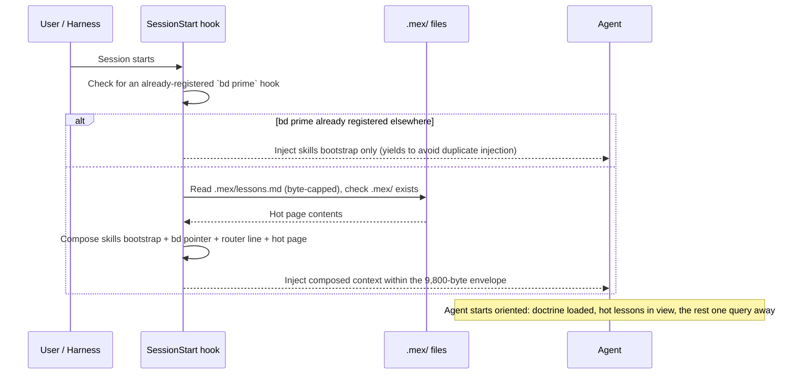
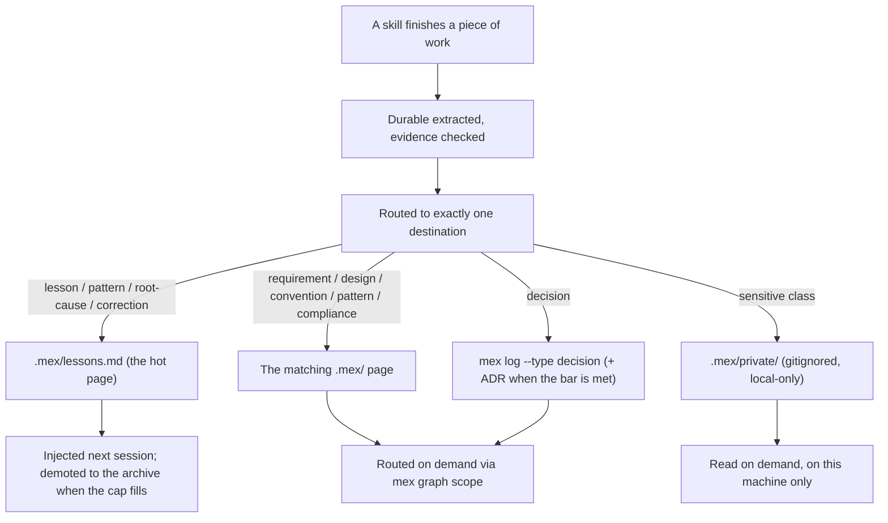
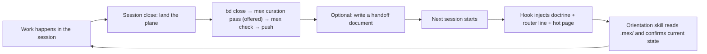

---
sidebar:
  order: 5
description: The durable-knowledge architecture - what gets injected at session start, how knowledge is retrieved, captured, curated, and checked for drift.
---

<!-- Role: what the machinery does with durable knowledge across a session's life - injection, retrieval, capture, curation, drift. Does NOT belong here: why these designs were chosen (philosophy.md), bd command reference (upstream Beads docs), or mex CLI reference (upstream mex docs). -->

# Memory & Sessions

Every session starts from zero context and ends with the process gone. What survives between the two is whatever the last session wrote down and the next one gets handed back. This page describes that machinery: the split between the two stores, what lands in the agent's context before you type, how a page is retrieved, written, curated, and checked. For why the plugin is shaped this way rather than some other way, see [philosophy.md](philosophy.md).

## Two stores, one rule

**`bd` tracks work; mex holds knowledge.** That sentence decides where anything you want to keep goes, and it is the doctrine the skills enforce.

| Store | Holds | Surfaced how | Synthetic example |
|---|---|---|---|
| `bd` (beads) | Work: tasks, epics, dependencies, status, closing evidence | `bd ready`, `bd show`, the session-start command pointer | "Task: add retry backoff to the queue worker" |
| `.mex/` tracked pages | Durable knowledge: requirements, architecture, conventions, patterns, compliance, decisions, lessons | The hot page at every session start; every other page routed on demand | "The staging config lives in `config/staging.yaml`, not the repo root" |
| `.mex/private/` | Sensitive durables: unmitigated risk, security gap, compliance exposure, unreleased plan | Read from disk when the work calls for it; gitignored, so it never leaves this machine | "Risk: the export endpoint has no rate limit until the 0.4 release" |

A bead is a unit of work with a lifecycle; it opens, gets claimed, and closes. A `.mex/` page is a standing statement about the project that is still true after the work that produced it is closed. Reference material never goes into the tracker, and task state never goes into a page.

Long-form Architecture Decision Records stay where they always were, in `docs/decisions/`. What changed is that a decision is also logged with `mex log --type decision`, which is what makes the ADR retrievable from the knowledge layer instead of only findable by someone who already knows the folder exists.

## What lands in context at session start

A `SessionStart` hook runs before the agent sees your first message. It reads the `using-superpowers` skill, which carries the doctrine above and routes to every other skill, then appends two blocks: a short `bd` command pointer, and a durable-knowledge section holding a router line plus the contents of `.mex/lessons.md`.

The hook does file reads only. It never shells out to `mex`, because routing and ranking belong to the agent at retrieval time, not to session-start policy. The `bd` pointer appears only when `bd` is installed; the durable-knowledge section composes either way, since `.mex/` is a directory of files rather than a beads feature. If another hook has already registered `bd prime` for this project, the whole block yields, so nothing is injected twice.

The injected envelope is budgeted at 9,800 bytes. Claude Code persists any single hook output above 10,000 characters out-of-line, which turns injected context into a pointer the agent has to go fetch, so the budget sits just under that threshold with 200 characters of margin. The plugin's own injection-budget decision record set that budget at 9,500 first; it was raised to 9,800 because a hot page at its full 2,048-byte cap could not fit whole at 9,500, and a hot page that arrives clipped on every session defeats the point of having one. The escaped string is measured for real at the output boundary, and any excess comes out of the hot page rather than out of the skills bootstrap.



If there is no `.mex/` directory, the section says so in one line and names the fix: run the `project-init` skill. The message goes into the agent's context rather than to stderr, because the agent is the one who can act on it.

## The hot page

`.mex/lessons.md` is the only page injected unasked, and it is hard-capped at 2,048 bytes. Think of it as a working set, not an archive: the lessons that should be in front of every session before anyone asks a question.

Each entry is one bullet, prefixed by kind (`lesson:`, `pattern:`, `root-cause:`, or `correction:`), with its evidence named - a file, a test, a command, a closed bead. An entry that restates an existing one is merged into it instead of added beside it.

When an append would push the page past 2,048 bytes, the coldest entries - oldest, least referenced - move to `.mex/lessons-archive.md` until the new one fits. Demotion is not deletion: the archive is still routed and still retrievable, it simply stops being injected. The move in the other direction has a bar of its own. **Twice-burned promotes:** a routed lesson whose absence cost a session moves onto the hot page. One miss is not enough; two is.

If the page is over its cap anyway, the hook clips it and appends a visible truncation marker naming the cap and the fix. A clipped page must never look complete.

## Retrieval

Everything outside the hot page is pulled on demand, and the process skills open with it. Before proposing a design, the agent queries the store:

```bash
mex graph scope "<task summary>"
```

A routed hit is a pointer, not knowledge. The contract is to open every routed page that plausibly bears on the work and read it in full - pages are distilled by design, so reading them whole is sanctioned spend - and then report what the check found:

```text
mex retrieval: 4 pages routed, 2 read
```

Zero relevant pages is not proof that none exist. The scope query gets re-angled once, with different nouns or a component name instead of a feature name, before the agent concludes there is nothing. Each page that was read gets a one-line disposition: folded in, with what it changed, or ruled out, with why. When `.mex/context/decisions.md` or an ADR in `docs/decisions/` already settles the question, the agent surfaces it instead of re-litigating it.

`.mex/ROUTER.md` is the human-readable entry point to the same map, and the line the hook injects points at it.

## Capture

Capture happens at the end of a piece of work, and the destination is the decision. Each durable is classified once, and its class says where it is written and by what.

| Session durable | Destination | Written by |
|---|---|---|
| Requirement or PRD statement | `.mex/requirements.md` | file edit |
| Design rationale | `.mex/architecture.md` | file edit |
| Convention - how this repo does a thing | `.mex/conventions.md` | file edit |
| Reusable code pattern | `.mex/patterns/<name>.md` | file edit |
| Compliance durable | `.mex/compliance.md` | file edit |
| Unmitigated risk, security gap, compliance exposure, unreleased plan | `.mex/private/` | file edit |
| Decision | `mex log --type decision`, plus an ADR when the bar is met | `mex log` |
| Lesson, pattern, root cause, correction | `.mex/lessons.md` | file edit |
| Procedural how-to - steps an agent follows | Banned from the store; it belongs in a skill | — |

Two details about decisions are easy to get wrong and expensive to discover later. Bare `mex log` records kind `note`, not `decision`, so the `--type decision` flag is what makes a decision a decision. And there are two files with similar names: `.mex/context/decisions.md` is the prose page, while `.mex/events/decisions.jsonl` is the append-only event log, created lazily by the first `mex log` call.

The bar for writing anything at all is evidence. A claim goes into the store only if it carries something checkable - a cited `file:line`, a passing test, command output, a closed bead. No evidence, no entry.

## Curation

The `mex-curator` skill runs the sweep: at session close when the work produced durable knowledge, or on demand when the store needs a pass. It extracts candidate durables from the session, routes each to exactly one destination, reconciles it against what the page already holds, and only then writes.

Two rules protect the layer every future session reads.

**Propose, then apply.** The sweep emits its full change list - every page edit, every decision line, each with a one-line reason - and waits for approval before touching anything. It also names the rollback path with the proposal, which for tracked pages is the pre-sweep commit and for `.mex/private/` is nothing at all.

**Never delete first.** Superseding an entry means writing the replacement, re-reading the file to confirm it landed, and only then removing what it replaced. A removal that runs before its successor exists loses the durable outright, and nothing in `.mex/` warns you.

Secrets are never written into any store. Not a tracked page, not a log line, and not `.mex/private/` either - a gitignored directory is not a vault. A credential found in a candidate is flagged for removal, never relocated, and the surrounding conclusion is written only once the value is out, naming the credential by location instead of by value.



## The private store and what it costs

The sensitive class - an unmitigated risk, a security gap, a compliance exposure, an unreleased plan - goes to `.mex/private/`, which is gitignored.

State the trade-off plainly, because it is a real one. `.mex/private/` is local-only. It does not sync between machines, a teammate never sees it, a fresh clone starts without it, and it has no rollback through git. That cost is accepted deliberately: this class of durable must not land on a tracked page in a public repo. When others do need to know, the fix is a sanitized version on the tracked page with the sensitive detail left private - never moving the sensitive detail out to buy sync.

## Drift

`mex check` validates the store, and its exit code is the gate. Warnings at exit 0 are the stock baseline, not a failure: a freshly created scaffold scores 79/100 with seven warnings, all from placeholder rows mex itself ships.

```bash
mex check    # gate on the EXIT CODE, never on a warning-free report
```

A non-zero exit gets one `mex sync` attempt, followed by a second `mex check` - and it is that second check's exit code that counts. `mex sync` exits 0 having repaired nothing when errors are present and stdin is closed, so its own exit code proves nothing. If the second check still fails, or the drift is wider than the pages this session touched, the session lands anyway with the dirty state and a filed bead stated out loud. A dirty store that is disclosed is fine; a dirty store that is not is a false green.

The same check runs as part of landing the plane: `bd close` → `mex check` → `bd dolt push` → `git push`.

Worth disclosing while you are here: mex 0.7.1 ships with telemetry enabled by default, so `mex check` - like every other mex command - reports a machine id from `~/.mex/telemetry-id`, the OS, the Node and mex versions, and the scaffold id over the network; `mex telemetry status` shows the current setting, and `mex config set` is documented as the way to turn it off, though the exact key was not observed in 0.7.1.

## What the code graph covers

`mex graph` indexes source files so that `mex impact <symbol|file>` can tell you which pages a code change touches. That indexing covers a subset of languages, and the boundary matters more than the headline.

Verified live against mex 0.7.1: JavaScript, TypeScript, and Python index, including `.cjs` and `.mjs`. Files inside dot-directories are skipped regardless of extension. Rust is claimed upstream but was not exercised here, so treat it as unconfirmed rather than supported.

On anything outside that set - shell, Markdown, Go, and the rest - `mex impact` finds nothing, and the pages, the router, and `mex graph scope` remain the working surface. Symbol grounding is progressive enhancement on top of a store that works without it, which is why a repo made mostly of shell scripts and Markdown loses precision but not function.

## The session loop

One session's close feeds the next session's start. Work happens, beads close with evidence, the curator distills whatever the session learned, `mex check` gates the store, and both remotes get pushed. A handoff document is optional on top of that; some sessions end cleanly enough that the hot page carries the thread on its own.



## Requirements and migration

mex is a hard dependency of this plugin's knowledge layer, pinned at `mex-agent` 0.7.1 and requiring Node 22.5.0 or newer. The `project-init` skill owns setup: it creates the pages this product adds on top of the stock scaffold - `.mex/lessons.md`, `.mex/lessons-archive.md`, and `.mex/private/` - none of which mex creates or reads on its own. If a skill reports them missing, run `project-init` rather than improvising a layout.

Earlier versions of this plugin kept durable knowledge in beads, as deferred knowledge-beads written with `bd remember` and read back with `bd memories`. Both are retired product-wide: knowledge now lives in `.mex/`, and no skill writes to the old store. If you have an existing store from those versions, the "Migrating from knowledge-beads" path in the `project-init` skill covers moving it across.

## Running without the knowledge layer

The skills in this plugin are plain instructions, and they still load without `bd` or `mex` installed. What you lose is this page. Beyond the skills bootstrap, the only thing injected at session start is the one-line notice that no `.mex/` store was found; there is nothing to route against, and each session starts as cold as the first one.

The skills do not paper over that. Every `mex` call in them is load-bearing: when one errors, the agent surfaces the exact command and its output and stops the knowledge step, rather than hand-writing a stand-in that would leave a store looking current when it is not.
