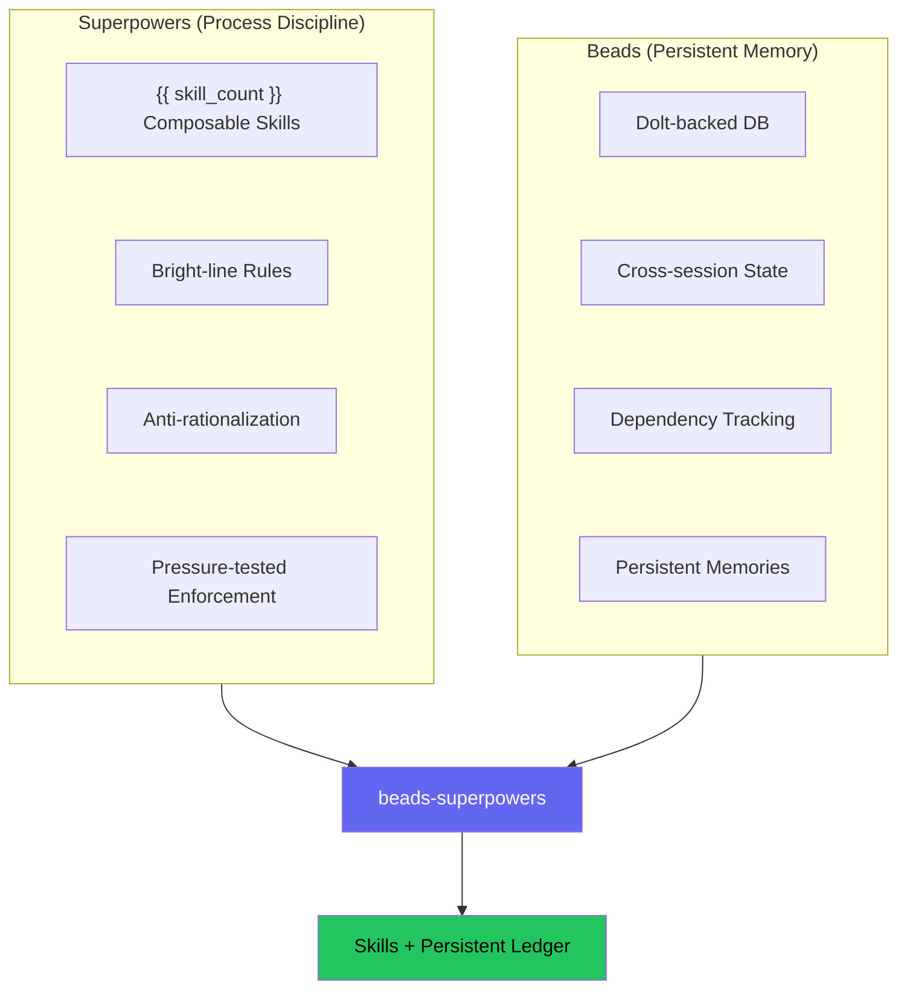
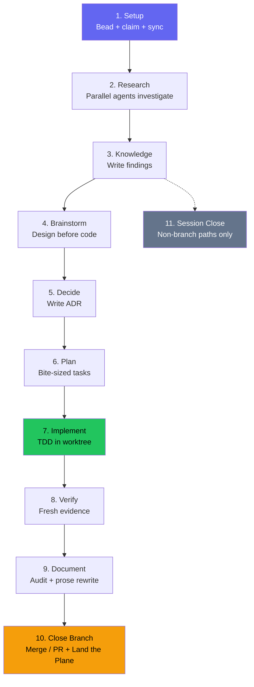

---
sidebar:
  order: 6
description: Bright-line rules and anti-rationalization tables enforce agent discipline. Dolt-backed beads track every task across sessions through a 10-state lifecycle.
---

<!-- Role: how the discipline is engineered - the mechanism story (Iron Laws, red-flag tables, skill anatomy, the lifecycle). Does NOT belong here: why decisions were made (philosophy.md), the evidence (research.md), or the memory machinery (memory.md). -->

# Methodology

## The problem

Ask an AI coding agent to build a feature and watch what happens. It skips straight to code, writes implementation before tests, claims the work is "done" without running verification, and if you point out a problem it agrees instantly rather than pushing back. Start a new session the next day and every task it was tracking has vanished.

Two projects attacked each half of this.

### Process discipline

[Superpowers](https://github.com/obra/superpowers) (Jesse Vincent) shipped 14 skills that force agents to brainstorm before coding, write tests before implementation, investigate root causes before proposing fixes, and verify before claiming completion. The skills use bright-line rules, like "NO PRODUCTION CODE WITHOUT A FAILING TEST FIRST," instead of hedged guidance like "consider writing tests," because an agent left room to negotiate a suggestion usually finds a way to talk itself out of it; see [Research](research.md) for the evidence behind that choice. Each skill includes an anti-rationalization table that preempts the excuses agents use to skip steps.

### Persistent memory

Superpowers tracked tasks with `TodoWrite`, which vanishes when a session ends. [Beads](https://github.com/gastownhall/beads) (Steve Yegge) replaced that with a Dolt-backed issue tracker where every task is a bead with a hash-based ID that survives session boundaries. Beads handles dependency tracking, cell-level merges for conflict-free multi-agent work, and a full audit trail via the events table.

Work state is only half of what a session needs to keep, so the plugin splits the job: **`bd` tracks work; mex holds knowledge.** Requirements, architecture, conventions, decisions, and lessons live as Markdown pages in a repo-local `.mex/` store, retrieved by a router rather than dumped into every session. At session start the hook injects the skills bootstrap, a short `bd` command pointer, and one durable-knowledge block: a router line plus the 2 KB hot page of lessons. It does that in a single pass because firing beads' own standalone `bd setup claude` hook alongside it would inject duplicate context and waste tokens; if that standalone hook is already registered, this hook yields instead of injecting a second copy.

!!! info "Go deeper — upstream Beads docs"
    - [Core concepts](https://gastownhall.github.io/beads/core-concepts) — issues, dependencies, hash IDs, and the memory model
    - [Architecture](https://gastownhall.github.io/beads/architecture) — the Dolt engine and events table under the hood

### The gap

Superpowers enforced good process but forgot everything between sessions. Beads remembered everything but imposed no process on how work should be done. beads-superpowers connects the two: every process step in every skill creates, updates, or closes a persistent bead, and every durable conclusion it reaches is distilled into the `.mex/` knowledge store - so following the right process, tracking the work, and keeping what was learned are one action.

## How it works

The plugin installs {{ skill_count }} composable skills and a Dolt-backed task database. A `using-superpowers` bootstrap skill loads at session start and routes the agent to whichever skill fits the current task.

The first change was mechanical: every `TodoWrite` call across the original 14 Superpowers skills was replaced with the equivalent `bd` command.

| Before (TodoWrite) | After (Beads) |
|--------------------|---------------|
| `TodoWrite("Task 1: Implement login")` | `bd create "Task 1: Implement login" -t task --parent <epic-id>` |
| Mark task as in_progress | `bd update <task-id> --claim` |
| Mark task as completed | `bd close <task-id> --reason "Implemented login"` |
| "More tasks remain?" | `bd ready --parent <epic-id>` |

The replacement works at two levels. Execution skills track plan tasks as beads. Checklist-heavy skills like brainstorming (10 steps) create a bead for each internal step. Both levels persist, because if checklist tracking is ephemeral while task tracking is persistent, agents learn that some tracking is optional.

Subsequent changes went further:

**Production-grade doctrine.** Every session now carries a standing instruction to treat the work as production-facing with real users, no matter how small the task looks — the rationalization that ships the worst defects is "it's just a script." On its own initiative the agent does not take shortcuts, quietly drop a requirement, or accept a consequential trade-off, and it never weakens or removes a security control. A warranted exception is surfaced for the user to decide; a security regression is refused outright. The rule lives once in `using-superpowers`, which the session-start hook injects in full every session, and the gate skills — brainstorming, stress-test, code review, and the completion check — reference it where those decisions actually get made.

**Prompt template pattern.** Subagent definitions moved from standalone agent files into prompt templates owned by the skills that dispatch them (`implementer-prompt.md`, `researcher-prompt.md`). One source of truth per subagent role — no drift between the skill's expectations and the subagent's instructions. A standalone agent file and its skill drift apart from each other over time as one changes without the other; keeping the prompt inside the skill closes that gap by construction.

**Parallel batch mode.** When `bd ready --parent` returns multiple unblocked tasks, `subagent-driven-development` executes them concurrently (max 5 per batch), each in its own `bd worktree`.

**Orchestrator-only design.** Only the orchestrating agent creates, claims, and closes beads. Subagents focus on their job. The one exception is `implementer-prompt.md`, which is beads-aware by design — it includes bead lifecycle commands, mandatory skill invocations, and LSP-first code navigation.

**Skill discovery.** Every skill's YAML `description` field states only a trigger condition, never a workflow summary: "use when task X happens," not "does Y then Z." A description that reads like a summary gets followed on its own, and the steps that live in the full skill body get skipped. See [Research](research.md) for how that was found.

**Pressure-tested rules.** Before a rule ships, it runs through a RED/GREEN cycle: RED is a subagent facing the pressure scenario without the skill, violating the rule; GREEN is the same scenario with the skill present, and the agent complying. A loophole that survives GREEN gets the rule rewritten and tested again. See [Research](research.md) for how that testing works.

## The lifecycle

A non-trivial feature request moves through up to 10 states. Simple tasks skip research and planning (S2–S6) but still pass through the quality pipeline (S7–S10). S11 (Session Close) fires only on non-branch paths like research queries.

**Step 1 — Setup.** Every task begins with a bead. Before any research or code, the work is captured (`bd create`), claimed (`bd update --claim`), and synced. If the session dies, the bead record shows an in-progress item that can be recovered.

**Step 2 — Research.** The `research-driven-development` skill decomposes the topic into sub-questions and dispatches one researcher per sub-question in parallel — plus an `@explore` agent that maps the affected code when the topic touches the codebase. Running them concurrently cuts research time sharply, and each agent returns a verbatim quote for every load-bearing claim, which a separate blinded verifier then double-checks by independently re-fetching the source, so findings are grounded in what the sources actually say rather than taken on trust.

**Step 3 — Knowledge capture.** Findings are written to a persistent document, then distilled into `.mex/`: requirements, architecture, and convention conclusions onto their matching pages, and every load-bearing conclusion logged with `mex log --type decision`. The document is the long form; the pages are what a later session actually retrieves.

**Step 4 — Brainstorming.** The `brainstorming` skill walks through context, clarifying questions, 2–3 approaches with trade-offs, and a design spec committed to git. It ends by invoking `writing-plans` — not by jumping to code. The spec-review gate offers a `stress-test` every time, to interrogate the design adversarially before planning.

**Step 5 — Decision capture.** Every settled decision is logged: `mex log --type decision "<one-line decision>"` runs unconditionally, and that log line is what makes the decision — and any ADR written for it — retrievable later. The full Architecture Decision Record in `docs/decisions/` — a timestamped note of the context, decision, rationale, and consequences — is added on top only when the ADR bar is met: the choice is hard to reverse, surprising without its context, and a real trade-off. These are recognition marks, not a checklist to slip past: when a decision plausibly fits, the agent leans toward offering rather than skipping, and only routine clarifications and scope calls stay out. The rule lives once in `using-superpowers` and is echoed where decisions actually get made: brainstorming, planning, stress-testing, and the pivot in a debugging session.

**Step 6 — Planning.** `writing-plans` breaks the design into bite-sized tasks (2–5 minutes each) with exact file paths, code, and verification steps. Every task becomes a bead.

**Step 7 — Implementation.** Code runs in an isolated git worktree under TDD. The orchestrator creates an epic with task children and dependency chains, then dispatches implementer subagents. When multiple tasks are unblocked, parallel batch mode runs up to 5 concurrently, each in its own worktree. After each task, one read-only reviewer returns a spec-compliance verdict and a code-quality verdict in a single pass; the bead closes only after that review passes. If it finds issues, each fix round dispatches a fresh implementer and a re-review scoped to the fix — capped at five rounds, after which the run stops and surfaces the open findings rather than looping. Task briefs, implementer reports, and review diffs move between stages as files under a per-plan, per-worktree `.internal/sdd/<plan-basename>/` directory, keeping the orchestrator's context lean.

**Step 8 — Verification.** The full test suite runs fresh — not relying on the last run during development. "Tests pass" means a test command was just executed and its output is attached.

**Step 9 — Documentation.** `document-release` scans the diff against existing docs for stale references, missing entries, and outdated examples. When the audit flags sections needing major prose rewrites, `write-documentation` fires for those sections.

**Step 10 — Close branch.** `finishing-a-development-branch` detects the current environment — normal repository, named-branch worktree, or detached HEAD — and presents context-aware options: 4 choices for normal and worktree contexts, 3 for detached HEAD where merge is unavailable. Provenance-based cleanup only removes worktrees inside `.worktrees/`, leaving externally created worktrees alone. The skill ends with the Land the Plane protocol: if the session captured roughly three or more new durables into `.mex/`, or the hot page came in truncated, offer a `mex-curator` pass first; then `bd close` → `mex check` → `bd dolt push` → `git push` → `git status`. Branch paths terminate here — work is not done until both task state and code reach the remote. The ritual lives inside this skill rather than a separate one so every branch path ends here structurally, instead of depending on a router remembering to invoke a second skill; non-branch sessions reach the same ritual through Step 11's session-close path below.

**Step 11 — Session close.** Fires only on non-branch paths (research queries, quick tasks that didn't create a branch). Runs the same close ritual as Step 10's Land the Plane: close beads, offer a `mex-curator` pass when the session produced curation-worthy volume, run `mex check`, push to remotes, verify clean state. The next session's start-hook injection restores the full picture.

## Agent memory

Knowledge accumulates as a side effect of following the workflow. Most of the {{ skill_count }} skills carry the same capture contract at their natural completion points: root causes after debugging, design rationale after brainstorming, review insights after code review, each recorded as an evidence-backed entry on the `.mex/` page its class routes to. Capture stays inside the skill workflow instead of becoming a separate step, and the `mex-curator` skill is the enforcement pass over what those skills wrote.

The retrieval half is symmetrical: before proposing a design, a process skill queries the store with `mex graph scope "<task>"`, reads the routed pages in full, and reports what it found. A routed hit is a pointer, not knowledge.

See [Memory & Sessions](memory.md) for what gets injected at session start, where each class of durable is written, and how retrieval and drift checks work.

## Where the rest lives

The literature and measurements behind the choices on this page are collected in [Research](research.md).

Why the plugin is built this way, not just how it runs, lives on [Philosophy](philosophy.md): the design-before-code gate, evidence before claims, the orchestrator-only rule, curated injection instead of context dumps, and keeping skills as plain Markdown. This page tracks the mechanism those choices produced, not the case for them.

## Sources

- [obra/superpowers](https://github.com/obra/superpowers) v6.2.0 — composable skills for AI agents (MIT)
- [gastownhall/beads](https://github.com/gastownhall/beads) v1.1.2 — Persistent issue tracker for AI agents (MIT)
