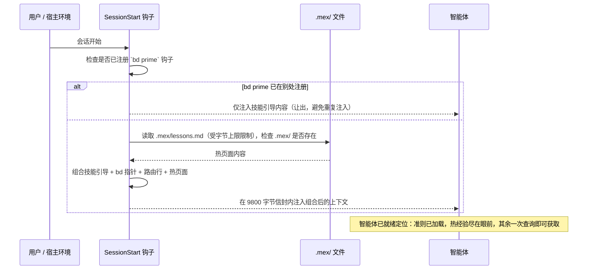
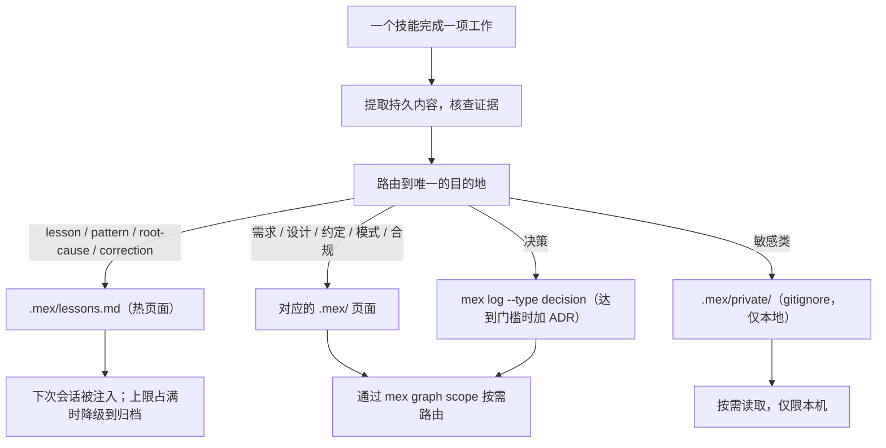

---
sidebar:
  order: 5
description: 持久知识架构——会话启动时注入什么，知识如何被检索、写入、整理，以及如何检查漂移。
machine_translated: true
---
!!! warning "机器翻译"
    本页面由 AI 自动翻译，可能存在术语或语义偏差。如有疑问，请以[英文原文](memory.md)为准。

<!-- Role: 本页描述这套机制在一个会话生命周期内对持久知识做的事——注入、检索、写入、整理、漂移。不属于本页范围：为何选择这些设计（见 philosophy.md）、bd 命令参考（见上游 Beads 文档），或 mex CLI 参考（见上游 mex 文档）。 -->

# 记忆与会话

每个会话都从零上下文开始，随着进程终止而结束。在两者之间存活下来的，是上一个会话写下、而下一个会话被递还的东西。本页描述这套机制：两个存储之间的分工、在你输入任何内容之前有什么会落入智能体的上下文，以及一个页面如何被检索、写入、整理和校验。至于插件为何采用这种形态而非别的形态，请见 [philosophy.md](philosophy.md)。

## 两个存储，一条规则

**`bd` 追踪工作；mex 保存知识。** 这句话决定了你想留存的任何东西该往哪里放，也是各技能强制执行的准则。

| 存储 | 内容 | 如何浮现 | 合成示例 |
|---|---|---|---|
| `bd`（beads） | 工作：任务、epic、依赖、状态、收尾证据 | `bd ready`、`bd show`，以及会话启动时注入的命令指针 | "任务：为队列 worker 加上重试退避" |
| `.mex/` 受版本管理的页面 | 持久知识：需求、架构、约定、模式、合规、决策、经验 | 热页面在每次会话开始时注入；其余页面按需路由 | "预发布环境的配置文件在 `config/staging.yaml` 里，而不是仓库根目录" |
| `.mex/private/` | 敏感类持久内容：未缓解的风险、安全缺口、合规暴露面、未发布的计划 | 工作需要时从磁盘直接读取；被 gitignore，因此永远不会离开这台机器 | "风险：导出接口在 0.4 版本之前没有限流" |

一个 bead 是一个有生命周期的工作单元：它被创建、被认领、被关闭。一个 `.mex/` 页面则是关于这个项目的常驻陈述——在产出它的那项工作关闭之后，它依然成立。参考材料绝不进入任务追踪器，任务状态也绝不进入知识页面。

长篇的架构决策记录（ADR）仍留在原处，也就是 `docs/decisions/`。变化的是：一条决策同时会用 `mex log --type decision` 记一笔，正是这一笔让 ADR 能从知识层被检索到，而不再只有已经知道该目录存在的人才找得到。

## 会话启动时有什么进入上下文

在智能体看到你的第一条消息之前，一个 `SessionStart` 钩子就已运行。它先读取 `using-superpowers` 技能——该技能承载上面那条准则，并路由到所有其他技能——然后追加两个区块：一段简短的 `bd` 命令指针，以及一个持久知识区块，内含一行路由指引和 `.mex/lessons.md` 的内容。

钩子只做文件读取，从不调用 `mex`，因为路由与排序属于智能体在检索时的工作，而不是会话启动时的策略。`bd` 指针仅在安装了 `bd` 时出现；持久知识区块两种情况下都会组合出来，因为 `.mex/` 是一个文件目录，而不是 beads 的功能。如果本项目中已有其他钩子注册了 `bd prime`，整个区块会让出，因此不会被注入两次。

注入信封的预算是 9800 字节。Claude Code 会把任何单次钩子输出中超过 10000 字符的部分转为进程外持久化，这会把注入的上下文变成智能体还得再去取一次的指针，所以预算刚好压在该阈值之下，留出 200 字符的余量。本插件自己的注入预算决策记录最初把预算定为 9500；后来提高到 9800，原因是一张处于 2048 字节上限的热页面在 9500 下无法完整放入，而每次会话都被裁剪的热页面就失去了存在的意义。转义后的字符串会在输出边界处被真实测量，超出部分从热页面里扣，而不是从技能引导内容里扣。



如果没有 `.mex/` 目录，该区块会用一行说明这一点，并指出解决办法：运行 `project-init` 技能。这条消息进入智能体的上下文而非 stderr，因为智能体才是能处理它的那一方。

## 热页面

`.mex/lessons.md` 是唯一会被主动注入的页面，其硬上限为 2048 字节。请把它当作工作集，而不是归档：那些在任何人提问之前就该摆在每个会话面前的经验。

每个条目是一条要点，以类别前缀开头（`lesson:`、`pattern:`、`root-cause:` 或 `correction:`），并写明其证据——一个文件、一个测试、一条命令，或一个已关闭的 bead。与已有条目重复表述的内容会被合并进去，而不是并排新增。

当一次追加会把页面推过 2048 字节时，最"冷"的条目——最旧、被引用最少的——会被移到 `.mex/lessons-archive.md`，直到新条目放得下为止。降级不等于删除：归档仍可被路由、仍可被检索，只是不再被注入。反方向的移动则另有门槛。**吃两次亏才升级：** 一条被路由的经验，若其缺席让某个会话付出了代价，就会被提升到热页面。一次疏漏不够，两次才算。

如果页面仍然超限，钩子会裁剪它并追加一个显式的截断标记，写明上限与解决办法。被裁剪的页面绝不能看起来像是完整的。

## 检索

热页面之外的一切都按需拉取，流程类技能一上来就做这件事。在提出任何设计之前，智能体先查询知识库：

```bash
mex graph scope "<task summary>"
```

一次路由命中只是指针，不是知识。契约是：打开每一个可能与本次工作相关的被路由页面并完整读完——页面本就是蒸馏过的，整页读取属于合理开销——然后报告这次检查的结果：

```text
mex retrieval: 4 pages routed, 2 read
```

零个相关页面并不能证明确实没有。在得出"没有"的结论之前，scope 查询要换个角度重试一次：换一组名词，或者用组件名代替功能名。每一个被读过的页面都要给出一行处置说明：已采纳（改变了什么），或已排除（为什么）。当 `.mex/context/decisions.md` 或 `docs/decisions/` 里的某个 ADR 已经解决了这个问题时，智能体应把它摆出来，而不是重新争论一遍。

`.mex/ROUTER.md` 是同一张地图面向人类的入口，钩子注入的那一行正指向它。

## 写入

写入发生在一项工作收尾时，而目的地就是那个决定。每条持久内容只分类一次，其类别决定它被写到哪里、由什么写入。

| 会话产出的持久内容 | 目的地 | 写入方式 |
|---|---|---|
| 需求或 PRD 陈述 | `.mex/requirements.md` | 文件编辑 |
| 设计理由 | `.mex/architecture.md` | 文件编辑 |
| 约定——本仓库某件事的做法 | `.mex/conventions.md` | 文件编辑 |
| 可复用的代码模式 | `.mex/patterns/<name>.md` | 文件编辑 |
| 合规类持久内容 | `.mex/compliance.md` | 文件编辑 |
| 未缓解的风险、安全缺口、合规暴露面、未发布的计划 | `.mex/private/` | 文件编辑 |
| 决策 | `mex log --type decision`，达到门槛时再加一份 ADR | `mex log` |
| 经验、模式、根因、纠正 | `.mex/lessons.md` | 文件编辑 |
| 操作步骤类的 how-to——智能体照做的步骤 | 禁止入库；它属于某个技能 | — |

关于决策有两个细节很容易搞错，而且事后发现代价高昂。裸的 `mex log` 记录的类别是 `note`，不是 `decision`，因此正是 `--type decision` 这个参数才让一条决策成为决策。另外有两个名字相近的文件：`.mex/context/decisions.md` 是散文页面，而 `.mex/events/decisions.jsonl` 是只追加的事件日志，由第一次 `mex log` 调用惰性创建。

写入任何内容的门槛是证据。一条主张只有携带可核查的东西——引用的 `file:line`、通过的测试、命令输出、已关闭的 bead——才会入库。没有证据，就没有条目。

## 整理

`mex-curator` 技能负责这次扫描：在会话收尾且本次工作产出了持久知识时运行，或在知识库需要清理时按需运行。它从会话中提取候选持久内容，把每一条路由到唯一的目的地，与页面已有内容做对账，然后才写入。

有两条规则在保护这一层——此后每个会话读到的都是它。

**先提议，再执行。** 扫描会给出完整的变更清单——每一处页面编辑、每一条决策记录，各附一行理由——并在触碰任何内容之前等待批准。它还会随提议一并说明回滚路径：受版本管理的页面回滚到扫描前的那次提交，而 `.mex/private/` 则完全没有回滚。

**绝不先删除。** 替换一个条目意味着：先写下替代内容，重新读取文件确认它确实落盘，然后才移除被替换的内容。在替代内容存在之前就执行的移除会彻底丢失这条持久内容，而 `.mex/` 里没有任何东西会提醒你。

密钥绝不写入任何存储。不写入受版本管理的页面，不写入日志行，也不写入 `.mex/private/`——被 gitignore 的目录不是保险库。候选内容中发现的凭据会被标记删除，绝不转移存放；只有在值被清除之后才写下周边结论，并以位置而非值来指代该凭据。



## 私有存储及其代价

敏感类内容——未缓解的风险、安全缺口、合规暴露面、未发布的计划——进入 `.mex/private/`，该目录被 gitignore。

请把这个取舍讲明白，因为它是真实存在的代价。`.mex/private/` 仅限本地。它不会在机器之间同步，队友永远看不到它，全新克隆一开始就没有它，而且它没有 git 回滚。这个代价是有意接受的：这一类持久内容绝不能落在公开仓库中受版本管理的页面上。当别人确实需要知道时，正确做法是在受版本管理的页面上放一份脱敏版本、把敏感细节留在私有目录里——绝不是把敏感细节挪出来换取同步。

## 漂移

`mex check` 校验知识库，其退出码就是闸门。退出码为 0 时的告警属于出厂基线，而不是失败：一个刚创建的脚手架得分 79/100、带 7 条告警，全部来自 mex 自己附带的占位行。

```bash
mex check    # 以退出码为准，绝不以"没有告警"为准
```

非零退出码换来一次 `mex sync` 尝试，随后再跑第二次 `mex check`——真正算数的是第二次检查的退出码。当存在错误且 stdin 关闭时，`mex sync` 会在什么都没修复的情况下以 0 退出，所以它自己的退出码什么也证明不了。如果第二次检查仍然失败，或者漂移范围超出了本次会话触碰的页面，会话照常收尾，但必须明确说出脏状态并记录一个 bead。被披露的脏状态没问题；未被披露的脏状态就是假绿灯。

同一次检查也是 Land the Plane 的一环：`bd close` → `mex check` → `bd dolt push` → `git push`。

## 代码图谱覆盖到哪里

`mex graph` 会索引源码文件，使 `mex impact <symbol|file>` 能告诉你一次代码改动会牵动哪些页面。这种索引只覆盖部分语言，而这条边界比结论本身更重要。

针对 mex 0.7.1 实测确认：JavaScript、TypeScript 和 Python 会被索引，包括 `.cjs` 和 `.mjs`。位于点开头目录中的文件无论扩展名如何都会被跳过。Rust 是上游宣称支持、但此处未实测的，因此请把它当作未经确认，而不是已支持。

在这一集合之外的任何东西——shell、Markdown、Go 等等——`mex impact` 什么也找不到，此时页面、路由器和 `mex graph scope` 仍是可用的工作面。符号级定位是建立在一个没有它也能工作的知识库之上的渐进增强，这正是一个主要由 shell 脚本和 Markdown 构成的仓库会损失精度、但不会失去功能的原因。

## 会话循环

一个会话的收尾，衔接着下一个会话的开始。工作发生，beads 带着证据关闭，整理器蒸馏本次会话学到的东西，`mex check` 为知识库把关，两个远端都被推送。在此之上，交接文档是可选的：有些会话收尾得足够干净，热页面足以自行承接线索。


## 前置依赖与迁移

mex 是本插件知识层的硬性依赖，版本固定为 `mex-agent` 0.7.1，并要求 Node 22.5.0 或更新版本。安装工作由 `project-init` 技能负责：它会创建本产品在出厂脚手架之上追加的页面——`.mex/lessons.md`、`.mex/lessons-archive.md` 和 `.mex/private/`——这些 mex 自身既不会创建也不会读取。如果某个技能报告它们缺失，请运行 `project-init`，而不是自行拼凑一套布局。

本插件的早期版本把持久知识放在 beads 里，形式是用 `bd remember` 写入、用 `bd memories` 读回的延迟知识 bead。两者已在产品层面全面退役：知识现在存放在 `.mex/` 中，没有任何技能再写入旧存储。如果你还留有那些版本的存储，`project-init` 技能中的"Migrating from knowledge-beads"（从知识 bead 迁移）路径说明了如何搬迁。

## 不启用知识层运行

本插件里的技能都是纯文本指令，即便没有安装 `bd` 或 `mex`，它们照样能加载。你失去的是本页所写的一切：会话开始时除技能引导外，只会注入一行「未找到 `.mex/` 库」的提示，没有知识库可供路由，每个会话都和第一个会话一样冷启动。

技能不会为此打圆场。其中每一次 `mex` 调用都是承重的：一旦出错，智能体会原样给出命令及其输出并停止知识环节，而不是手写一个替代结果，让知识库看起来是最新的、实际上并不是。
