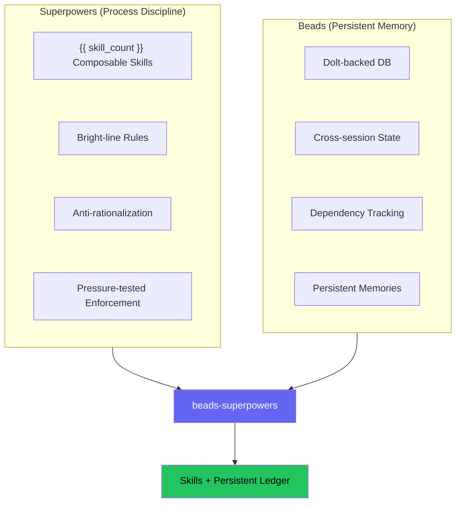
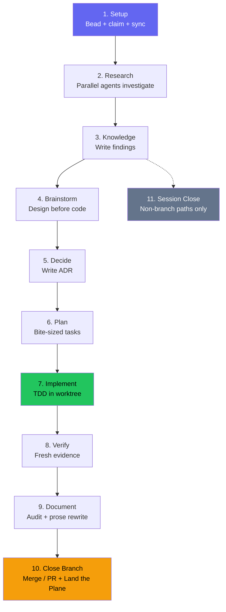

---
sidebar:
  order: 6
machine_translated: true
description: 通过严格规则和反合理化表格强制实施智能体纪律。Dolt 支持的 beads 跨会话跟踪每个任务，实现10个状态的完整生命周期。
---
!!! warning "机器翻译"
    本页面由 AI 自动翻译，可能存在术语或语义偏差。如有疑问，请以[英文原文](methodology.md)为准。

<!-- Role: how the discipline is engineered - the mechanism story (Iron Laws, red-flag tables, skill anatomy, the lifecycle). Does NOT belong here: why decisions were made (philosophy.md), the evidence (research.md), or the memory machinery (memory.md). -->

# 方法论

## 问题

让一个 AI 编程智能体构建一个功能，看看会发生什么。它直接跳到代码，先写实现再写测试，声称工作"完成"却不运行验证，你指出问题时它立刻同意而不是反驳。第二天开始新的会话时，它追踪的所有任务都消失了。

两个项目分别解决了各自的问题。

### 流程规范

[Superpowers](https://github.com/obra/superpowers)（Jesse Vincent）发布了14个可组合技能，强制智能体在编码前进行 brainstorming、在实现前编写测试、在提出修复建议前调查根本原因、在声称完成前进行验证。这些技能使用严格规则，例如"在没有失败测试的情况下，绝不编写生产代码"，而不是"考虑编写测试"这类模糊建议，因为一句留有商量余地的建议，智能体总能为自己找到不遵守的理由；这一选择背后的证据参见[研究](research.md)。每个技能都包含一个反合理化表格，预先消除智能体用来跳过步骤的借口。

### 持久记忆

Superpowers 使用 `TodoWrite` 追踪任务，但会话结束后这些记录就会消失。[Beads](https://github.com/gastownhall/beads)（Steve Yegge）将其替换为 Dolt 支持的问题追踪器，每个任务都是一个具有基于哈希 ID 的 bead，能够跨越会话边界持久存在。Beads 处理依赖追踪、无冲突多智能体工作的单元级合并，以及通过 events 表实现的完整审计追踪。

工作状态只是一个会话需要留存内容的一半，因此插件把这项职责一分为二：**`bd` 追踪工作；mex 保存知识。** 需求、架构、约定、决策和经验以 Markdown 页面的形式存放在仓库本地的 `.mex/` 库中，由路由器按需检索，而不是每个会话都全量倾倒。会话开始时，钩子注入技能引导内容、一段简短的 `bd` 命令指针，以及一个持久知识区块：一行路由指引加上 2 KB 的经验热页面。它在同一次调用中完成这些工作，因为若 beads 自身独立的 `bd setup claude` 钩子同时被触发，就会注入重复的上下文并浪费 token；如果检测到该独立钩子已经注册，本钩子会让出，而不再注入第二份内容。

!!! info "深入了解 — 上游 Beads 文档"
    - [核心概念](https://gastownhall.github.io/beads/core-concepts) — issues、依赖关系、哈希 ID 与记忆模型
    - [架构](https://gastownhall.github.io/beads/architecture) — 底层的 Dolt 引擎与 events 表

### 差距

Superpowers 强制执行良好流程，但会话之间会遗忘所有内容。Beads 记住所有内容，但对工作方式没有强制流程。beads-superpowers 将两者连接起来：每个技能中的每个流程步骤都会创建、更新或关闭一个持久 bead，而它得出的每条持久结论都会蒸馏进 `.mex/` 知识库——因此遵循正确流程、追踪工作状态、留存已学到的知识，是同一个动作。

## 工作原理

该插件安装 {{ skill_count }} 个可组合技能和一个 Dolt 支持的任务数据库。`using-superpowers` 引导技能在会话开始时加载，并将智能体路由到适合当前任务的技能。

第一个变化是机械性的：将原始14个 Superpowers 技能中的每个 `TodoWrite` 调用替换为等效的 `bd` 命令。

| Before (TodoWrite) | After (Beads) |
|--------------------|---------------|
| `TodoWrite("Task 1: Implement login")` | `bd create "Task 1: Implement login" -t task --parent <epic-id>` |
| Mark task as in_progress | `bd update <task-id> --claim` |
| Mark task as completed | `bd close <task-id> --reason "Implemented login"` |
| "More tasks remain?" | `bd ready --parent <epic-id>` |

替换在两个层面有效。执行技能将计划任务作为 bead 追踪。像 brainstorming（10个步骤）这样的检查表密集型技能为每个内部步骤创建一个 bead。两个层面都需要持久化，因为如果检查表追踪是短暂的而任务追踪是持久的，智能体就会认为某些追踪是可选的。

后续变化更进一步：

**生产级规范。** 现在每个会话都有一条常设指令，要求将工作视为面向真实用户的生产级别，无论任务看起来多么微小——"这只是个脚本"这种合理化思维会产生最糟糕的缺陷。智能体不得自行走捷径、悄悄删减需求或接受有重大影响的权衡，也绝不削弱或移除安全控制。有正当理由的例外需提交用户决定；安全回退则直接拒绝。该规则在 `using-superpowers` 中只存在一次，由 session-start 钩子在每次会话时完整注入，门控技能——brainstorming、stress-test、代码审查和完成检查——在实际做出这些决定时引用它。

**提示词模板模式。** 子智能体定义从独立的智能体文件移入由调度它们的技能拥有的提示词模板（`implementer-prompt.md`、`researcher-prompt.md`）。每个子智能体角色只有一个真相来源——技能期望与子智能体指令之间不会产生偏差。独立的智能体文件与其技能会随时间推移逐渐产生偏差，因为一方变化时另一方未必同步更新；把提示词放在技能内部，从结构上消除了这种偏差。

**并行批处理模式。** 当 `bd ready --parent` 返回多个未被阻塞的任务时，`subagent-driven-development` 并发执行这些任务（每批最多5个），每个任务在其自己的 `bd worktree` 中运行。

**仅编排者设计。** 只有编排智能体创建、认领和关闭 bead。子智能体专注于自己的工作。唯一的例外是 `implementer-prompt.md`，它在设计上具有 beads 感知——包含 bead 生命周期命令、强制技能调用和 LSP 优先的代码导航。

**技能发现。** 每个技能的 YAML `description` 字段只陈述触发条件，而不是工作流摘要：写"当任务 X 发生时使用"，而不是"先做 Y 再做 Z"。读起来像摘要的描述会被直接遵循，写在完整技能正文里的步骤就会被跳过。这一发现是如何得出的，参见[研究](research.md)。

**对规则的压力测试。** 每条规则在发布前都会经历一轮 RED/GREEN 循环：RED 是让子智能体在没有该技能的情况下面对压力场景，违反规则；GREEN 是同一场景下技能已经存在，智能体遵守规则。如果 GREEN 阶段仍然留有漏洞，规则就会被重写并重新测试。这项测试具体如何进行，参见[研究](research.md)。

## 生命周期

一个复杂的功能请求最多经历10个状态。简单任务跳过研究和规划（S2–S6），但仍然通过质量流水线（S7–S10）。S11（会话关闭）仅在研究查询等非分支路径上触发。

**步骤1——设置。** 每个任务都从一个 bead 开始。在任何研究或代码之前，工作被捕获（`bd create`）、认领（`bd update --claim`）并同步。如果会话中断，bead 记录显示一个可以恢复的进行中项目。

**步骤2——研究。** `research-driven-development` 技能将主题分解为子问题，并为每个子问题并行调度一个研究员——另外还有一个 `@explore` 智能体，当主题涉及代码库时映射受影响的代码。并发运行这些智能体大幅缩短研究时间，每个智能体为每个关键主张返回逐字引用，随后由一个独立的盲验证者重新抓取来源加以复核，使结论扎根于来源的实际表述，而非凭信任采纳。

**步骤3——知识捕获。** 发现先被写入持久文档，然后蒸馏进 `.mex/`：需求、架构与约定类结论写入各自对应的页面，每一条承重结论用 `mex log --type decision` 记录。文档是长篇形式，页面才是后续会话真正会检索到的东西。

**步骤4——Brainstorming。** `brainstorming` 技能依次处理上下文、澄清问题、2–3个带有权衡的方法，以及提交到 git 的设计规格说明。它通过调用 `writing-plans` 结束——而不是直接跳到代码。规格说明审查门每次都提供 `stress-test`，在规划前对设计进行对抗性审查。

**步骤5——决策捕获。** 每一个有了定论的决策都会被记录：`mex log --type decision "<一句话决策>"` 无条件执行，正是这一行日志让该决策——以及为它撰写的任何 ADR——在日后可被检索到。只有当满足 ADR 门槛时——该选择难以逆转、离开上下文令人困惑、且存在真实权衡——才会在此之上补记一条完整的架构决策记录（Architecture Decision Record）到 `docs/decisions/`，即一个包含上下文、决策、理由和后果的带时间戳的说明。这些是识别标志，而非可借故跳过的清单：当某个决策大体符合时，智能体倾向于提议记录而非略过，只有常规澄清和范围确认才排除在外。该规则在 `using-superpowers` 中只存在一次，并在实际做出决策的地方被引用：brainstorming、规划、stress-test 以及调试会话中的转折点。

**步骤6——规划。** `writing-plans` 将设计分解为小粒度任务（每个2–5分钟），包含精确的文件路径、代码和验证步骤。每个任务都成为一个 bead。

**步骤7——实现。** 代码在 TDD 约束下的隔离 git worktree 中运行。编排者创建一个包含任务子项和依赖链的 epic，然后调度实现者子智能体。当多个任务未被阻塞时，并行批处理模式并发运行最多5个，每个在其自己的 worktree 中。每个任务完成后，一个只读审查者在单次传递中返回规格说明合规判决和代码质量判决；bead 仅在审查通过后关闭。若审查发现问题，每一轮修复都会调度一个全新的实现者，以及一次仅针对该修复的复审——最多五轮，超出后运行将停止并呈报未解决的发现，而不是无限循环。任务说明、实现者报告和审查差异作为每个计划、每个 worktree 的 `.internal/sdd/<plan-basename>/` 目录下的文件在各阶段之间传递，保持编排者的上下文精简。

**步骤8——验证。** 完整测试套件重新运行——不依赖开发过程中的上次运行。"测试通过"意味着测试命令刚刚执行完毕且输出已附上。

**步骤9——文档。** `document-release` 扫描差异与现有文档的对比，查找过时引用、缺失条目和过时示例。当审计标记需要大量散文重写的部分时，`write-documentation` 对这些部分触发。

**步骤10——关闭分支。** `finishing-a-development-branch` 检测当前环境——普通仓库、命名分支 worktree 或游离 HEAD——并呈现上下文感知选项：普通和 worktree 上下文有4个选择，游离 HEAD（无法合并）有3个选择。基于来源的清理只删除 `.worktrees/` 内的 worktree，不影响外部创建的 worktree。该技能以 Land the Plane 协议结束：若本次会话向 `.mex/` 写入了大约三条及以上新的持久内容，或热页面是被截断后注入的，先提供一次 `mex-curator` 整理；随后 `bd close` → `mex check` → `bd dolt push` → `git push` → `git status`。分支路径在此终止——直到任务状态和代码都到达远端，工作才算完成。该流程被内置在这个技能里，而不是单独成立一个技能，这样每条分支路径都会在结构上终结于此，而不必依赖路由器记得再调用第二个技能；非分支会话则通过步骤11的会话关闭路径到达同一个仪式。

**步骤11——会话关闭。** 仅在非分支路径（研究查询、未创建分支的快速任务）上触发。运行与步骤10 Land the Plane 相同的关闭仪式：关闭 bead、在本次会话产出足够整理量时提供一次 `mex-curator` 整理、运行 `mex check`、推送到远端、验证干净状态。下一个会话由启动钩子注入恢复完整状态。

## 智能体记忆

知识是遵循工作流的副产物而逐步累积起来的。{{ skill_count }} 个技能中的大多数在其自然完成点带着同一份写入契约：调试后的根本原因、brainstorming 后的设计理由、代码审查后的审查洞察，每一条都作为有证据支撑的条目，写入其类别所路由到的 `.mex/` 页面。写入留在技能工作流内部，而不是变成单独的一步，而 `mex-curator` 技能则是对这些技能所写内容的把关环节。

检索的一半是对称的：在提出任何设计之前，流程类技能会用 `mex graph scope "<task>"` 查询知识库、完整读完被路由的页面，并报告结果。一次路由命中只是指针，不是知识。

关于会话开始时注入了什么、每一类持久内容写到哪里，以及检索与漂移检查如何工作，参见[记忆与会话](memory.md)。

## 其余内容的位置

本页所涉选择背后的文献与测量数据，收录在[研究](research.md)里。

插件为何采用这种构建方式，而不只是它如何运行，记录在[设计理念](philosophy.md)里：编码前的设计关卡、先有证据后下结论、仅编排者规则、精选注入而非上下文转储，以及让技能保持纯 Markdown 的原因。本页只追踪这些选择所产生的机制，而不追踪支持它们的理由。

## 来源

- [obra/superpowers](https://github.com/obra/superpowers) v6.2.0 — 适用于 AI 智能体的可组合技能（MIT）
- [gastownhall/beads](https://github.com/gastownhall/beads) v1.1.2 — 适用于 AI 智能体的持久化问题追踪器（MIT）
