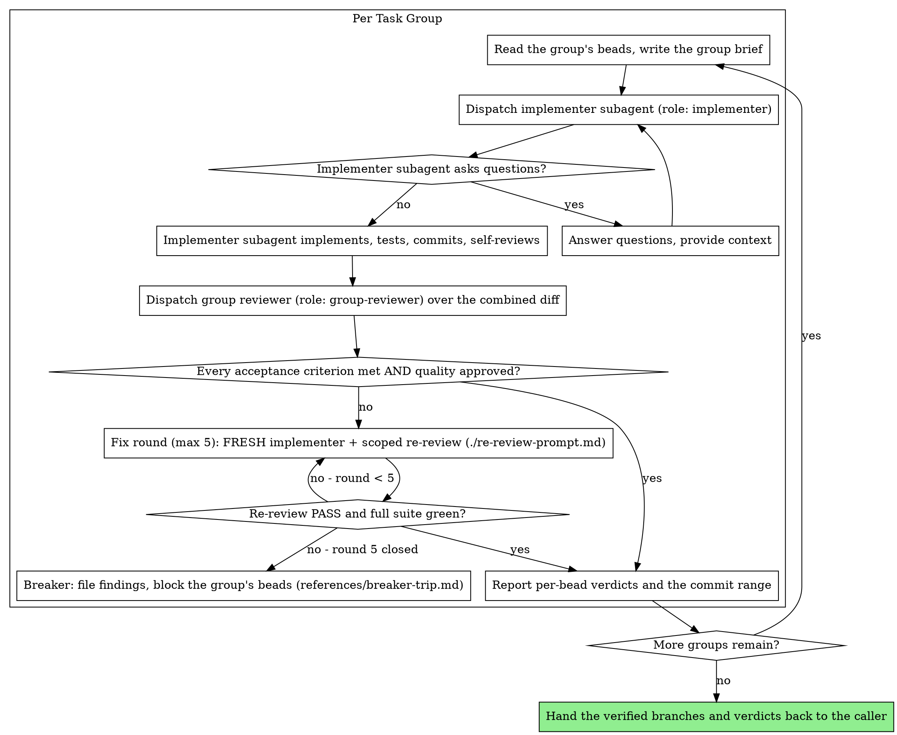

# Subagent-Driven Development

This skill is the task engine. A caller hands it work that is already captured as beads; it builds that work through fresh subagents, reviews it, and reports verdicts back.

## The Contract

| Part | Value |
| --- | --- |
| Input | One or more **task groups**. Each carries its task bead ids, the one `implementation_agent` those beads share, the non-overlapping paths they touch, and a worktree path. |
| Behavior | Per task group: one STE brief, one implementer subagent, one group review over the combined diff, then fix rounds under the five-round breaker. |
| Output | Verified commits on each group's branch, plus that group's review verdicts, reported per task bead id. |
| Bead closing | The caller closes each task bead individually. This engine **NEVER** closes a task bead. |

**Task group.** A set of task beads that one implementer subagent builds, in one worktree, under one review. Two constraints define it:

1. Every bead in the set names the same `implementation_agent` in its metadata.
2. No two beads in the set touch the same path.

A set that breaks either constraint is not a task group — split it until both constraints hold. **Always** call this thing a task group, in the brief, in the bead text, in the report, and in anything you say to the caller. A second name for it is how a subagent ends up thinking there are two things.

**This engine operates on existing beads.** `writing-plans` creates the initiative, the epics, and the task beads, and lints the graph before it hands off. This skill creates no task beads and parses no plan file (the breaker files blocker beads for discovered work, and nothing else). Each task bead's `## Acceptance Criteria` section is the requirement of record, and its `metadata` names the implementing role.

**Callers.** great_cto's `implementing-epics` is the normal caller: it forms the groups, invokes this engine, and closes the beads afterwards. The other entry is the user directing in-session execution after `writing-plans` presents its handoff — then you form the groups yourself, under the same two constraints, from `bd ready --parent <epic-id>`.

**Why subagents:** You delegate a task group to a specialized agent with isolated context. By precisely crafting its instructions and context, you ensure it stays focused and succeeds. It should never inherit your session's context or history — you construct exactly what it needs. This also preserves your own context for coordination work.

**Continuous execution:** Do not pause to check in with your human partner between task groups. Execute every group you were handed without stopping. The only reasons to stop are: BLOCKED status you cannot resolve, ambiguity that genuinely prevents progress, or all groups complete. "Should I continue?" prompts and progress summaries waste their time — they asked you to execute the work, so execute it.

## Pre-Flight Group Review

Before dispatching a group's implementer, read every bead in the group once and scan for conflicts:

- acceptance criteria that contradict each other or the epic's `## Success Criteria`
- anything a bead mandates that the review rubric treats as a defect (a test that asserts nothing, verbatim duplication of a logic block)
- a path claimed by two beads in the same group — that breaks the second grouping constraint, and the group has to be split before dispatch

Present everything you find to your human partner as **one combined structured question** — each finding beside the bead text that mandates it, asking which governs — before execution begins, not one interrupt per discovery mid-group. If the scan is clean, proceed without comment. The review loop remains the net for conflicts that only emerge from implementation.

## The Process



**Reading the group's state:** `bd show <task-id>` gives you a bead's acceptance criteria and metadata. On the in-session path, `bd ready --parent <epic-id>` gives you the unblocked task beads to form groups from, and `bd epic status <epic-id>` summarizes completion. Closing stays with the caller either way.

> **`--claim` consent boundary.** This skill's autonomous take-next / group-dispatch flow is the one place `bd ready --claim` is legitimate. That autonomous `--claim` is FORBIDDEN wherever the user picks the work (orientation, brainstorming, session close) — the consent gate binds even when this skill is not loaded.

## Running Groups Concurrently

Task groups do not share paths, so two groups can run at the same time without colliding — each in its own isolated `bd worktree`.

**Core principle:** One `bd worktree` per task group + concurrent dispatch = safe concurrency with per-group rollback.

**Concurrency cap:** at most five task groups in flight at once. If the caller hands you more, run the rest in a later wave.

### Before you fan out (orchestrator-only)

Worktrees isolate *files*, not *assumptions* — implementers on different files can still diverge on an un-prescribed shared decision (MAST FC2). Before dispatching:

1. **Front-load shared decisions** — list every decision two or more groups depend on (schemas, naming, interfaces, conventions); decide each once and write it verbatim into *every* group brief.
2. **Share full context, not summaries** — give each implementer the relevant traces and facts, not a lossy digest.

This is orchestrator discipline applied before dispatch; do not ask subagents to coordinate with each other.

### Concurrent Walkthrough

```
1. Create the shared worktree once, at the start:
     bd worktree create .worktrees/<initiative-name>

2. Check the work graph before dispatching:
     bd swarm validate <epic-id>
     → Shows wave structure (which work can run concurrently vs sequentially),
       max parallelism, estimated worker-sessions, and dependency warnings.
     Use it to catch missing dependencies before spending subagent runs on
     groups that will block.

3. For each task group in flight (at most five):
     bd worktree create .worktrees/<group-name> --branch feature/<epic>/<group>

4. Dispatch the implementers concurrently:
   Read ./implementer-prompt.md, then one Agent tool call per task group,
   ALL in the same message:
     Agent({
       description: "Implement group <name>",
       prompt: "<implementer-prompt content with 'Work from: <group-worktree-path>'>",
       subagent_type: "general-purpose"
     })

5. Group review per group (these can also run concurrently):
   Dispatch the group reviewer (./task-reviewer-prompt.md) with the group brief,
   the implementer's report file, and the review-package diff of the group's
   combined range. It returns one spec-compliance verdict per task bead id
   (✅/❌/⚠️) and one code-quality verdict for the group.

6. For each group that passes review:
     cd .worktrees/<initiative-name>
     git merge feature/<epic>/<group>
     bd worktree remove .worktrees/<group-name>
   Report the group's per-bead verdicts and commit range to the caller, which
   closes the beads.

7. Run the full test suite on the shared worktree (integration check):
   If it fails → invoke systematic-debugging → fix before the next wave.

8. Repeat from step 3 until no groups remain.
```

> **Tip:** Use `bd -C .worktrees/<group> ready` to check bead status across worktrees without changing directory.

> **Concurrent orchestrators (optional — `bd merge-slot`):** Step 6's merges run through a single orchestrator, one at a time, so the normal flow has no merge race and needs no coordination. The exception is when **two or more orchestrators or sessions** run this engine concurrently against the same repo — their merges into the shared base could collide. For that case only, serialize merges with the beads v1.0.5 merge slot: `bd merge-slot create` once for the repo, then wrap each merge as `bd merge-slot acquire` → `git merge feature/<epic>/<group>` → `bd merge-slot release`, so only one orchestrator resolves conflicts at a time. Pairs with the `bd swarm validate` pre-step above.

### Failed Group Handling

When a task group fails review:

1. **Do not merge** its branch into the shared branch.
2. **Option A — Fix rounds:** Keep the group's worktree and run **`## Fix Rounds` / `## The Breaker`** below, unchanged: five-round cap, a FRESH implementer every round, scoped re-review via `./re-review-prompt.md`, PASS gated on a green full suite. Concurrent execution gets no unbounded loop.
3. **Option B — Discard:** not a controller call. Discarding a failed group's branch (`bd worktree remove .worktrees/<group-name>`) is a disposition **the user** decides — surface it per `references/breaker-trip.md`; never adjudicate it yourself.
4. Groups that passed review are still merged independently — one failure does not block the others.

## Roles and Tiers

**Dispatch by role, never by model.** Every subagent this engine dispatches is named by a tier-map role, and the tier map is what binds a role to the model it runs on.

| Role | Where the name comes from | What it does |
| --- | --- | --- |
| `implementer` | the `implementation_agent` shared by the group's beads | builds the whole task group in the group's worktree |
| `group-reviewer` | fixed for this engine | reviews the group's combined diff against every acceptance criterion in the group |

`implementer` runs at the implementation tier. `group-reviewer` runs at the review tier, at high effort, because that is what its own agent definition pins.

**Never** write a model name into a dispatch, and never pass an effort value with one. Task beads carry no `effort` field: effort is set in the agent definition's frontmatter, so there is nothing to choose at dispatch time. A model name in a dispatch bypasses the tier map, which is the only thing that knows what a role should run on.

**The role is fixed for the group.** Fix rounds dispatch a fresh `implementer` — the same role, every round. There is no cheaper substitution and no escalation to a different agent: if the role the bead names is wrong for the work, say so and stop, rather than swap in another one.

## Handling Reviewer ⚠️ Items

The group reviewer returns a spec-compliance verdict of ✅, ❌, or ⚠️ per task bead. A ⚠️ "cannot verify from diff" item does **not** block that bead on its own — but you (the controller) must resolve it, because it usually needs context beyond the group that the reviewer lacks. Check the named requirement against the broader implementation. If the ⚠️ turns out to be a real gap, treat it as a failed spec review and re-dispatch the implementer to close it; if it is actually satisfied elsewhere, record that and proceed.

## Fix Rounds

A review returning findings starts a fix round: dispatch a **fresh implementer**
(never resume) with the group brief, the current findings, and only the **most
recent** section of the report file. **Record `ROUND0_HEAD` (round 0's final
commit, not `BASE`) before dispatching fix round 1** — it is round 1's `<fix-base>`.
Then dispatch a scoped re-review filling `re-review-prompt.md` against
`scripts/review-package <workspace-key> <fix-base> HEAD`.

**A re-review PASS requires the reviewer's verdict AND a green full test suite** —
**you (the controller) run the suite** and report it in `[SUITE_STATUS]`. What the
scoped reviewer cannot see, and why, is in `references/breaker-trip.md`.

**Completion criterion:** re-review returns PASS with a green suite, or the round
counter increments.

## The Breaker

The fix loop runs at most **five rounds** per task group. If round five closes with
findings still open, the breaker trips — follow `references/breaker-trip.md`.

**Completion criterion:** every open finding has a bead ID, the group's task beads are
`blocked`, and the round history is surfaced to the user. Filing findings and blocking
are yours; closing a task bead is the caller's, in every outcome.

Implementer status handling (BLOCKED / NEEDS_CONTEXT and friends): see `references/breaker-trip.md`.

> **Blocker-bead stamp:** `bd create "[spec] <title>" -t task --parent <epic-id> --notes "Severity:/Confidence:/Evidence:"` — see `verification-before-completion` → Agent-Filed Bead Discipline.

## Whole-Branch Review

The group review covers one group's diff. A review of every group together is the caller's
call: when `implementing-epics` supplied the groups, report that no whole-branch review has
run and let it decide. On the in-session path, run one yourself once every group is merged —
`scripts/review-package <workspace-key> <MERGE_BASE> HEAD` and the `group-reviewer` role over
the whole branch, which is the only place the composite of all groups and all fix rounds is
examined. Findings go to one fix subagent, then one scoped re-review; residuals follow the
breaker rules.

**Teardown:** remove the workspace once the reviews are clean **and** each group's outcome
and any implementer-raised concerns are recorded in beads. Reports are the only
non-regenerable artifact — delete once the record is durable.

## File Handoffs

Hand group text and review diffs to subagents as **files**, not pasted context — this keeps large text out of your own context and gives subagents a single thing to read.

- **The group brief is yours to write.** Read each bead in the group (`bd show <id>`), then write one brief covering all of them: the shared scene-setting context, then, per bead, its id, its acceptance criteria copied verbatim, and the paths it owns. Author it under the STE rules below. Pass the path to the implementer as "read this first — it is your requirements."
- The implementer writes its full report to the workspace (you name the path via `[REPORT_FILE]`); the reviewer reads it as a file. Fix rounds **append** to it.
- Before dispatching the reviewer, run `scripts/review-package <workspace-key> <BASE> <HEAD>` → writes the group's combined diff into the workspace. `BASE` is the commit recorded before the implementer ran — never `HEAD~1`.
- The reviewer is **read-only**: it must not mutate the working tree, the index, HEAD, or branch state.
- The workspace is resolved per working tree by `scripts/sdd-workspace <workspace-key>`. The workspace key is any existing file whose basename names the directory — the plan file `writing-plans` wrote, or the spec path the initiative bead points at. This engine never parses that file; it names the workspace and nothing else. Each `bd worktree` gets its own tree, so concurrent groups never share filenames.

## Authoring Text for Machine Readers (STE)

Every string you author in this workflow is parsed by an agent that cannot ask what
you meant: group briefs, scene-setting context in implementer prompts, answers to
subagent questions, review-finding relays, the verdicts you report to the caller, and
the durable insights you write to `.mex/lessons.md` per the capture contract.
Write them under the Simplified Technical English rules in
`references/ste-authoring.md` — short active sentences, one instruction per sentence,
one name per concept, hedges preserved.

The two failure modes this prevents are expensive here: a misread group brief costs a
full fix round, and synonym rotation across concurrent group briefs makes independent
implementers diverge on shared names (a divergence no worktree isolates). Run the
reference's six-item scan checklist before every dispatch. What you report back to the
caller gets the same treatment — it is re-parsed after compaction by an agent with no
other context.

## Prompt Templates

Dispatch via the `Agent` tool:

1. `Read` the prompt template file
2. Use its content as the `prompt` parameter
3. Use `subagent_type: "general-purpose"` (do NOT use `"implementer"` — that is Claude Code's built-in implementer agent with its own system prompt, which overrides the prompt template)

- `./implementer-prompt.md` - Dispatch the implementer subagent for one task group
- `./task-reviewer-prompt.md` - Dispatch the group reviewer (one spec verdict per task bead plus one code-quality verdict, in one read-only pass over the group's combined diff)
- `./re-review-prompt.md` - Scoped re-reviewer for fix rounds (checks the named findings only; PASS also requires a green suite)

## Example Walkthrough

```
Caller: implementing-epics hands over group A — beads bsp-a1, bsp-a2, bsp-a3,
        implementation_agent senior-dev, paths src/hooks/**, worktree
        .worktrees/group-a.

[bd show bsp-a1 / bsp-a2 / bsp-a3 → acceptance criteria + metadata]
[Pre-flight scan: no contradictions, no path claimed twice → proceed]
[Write the group brief: shared context, then one section per bead]

[Dispatch one implementer (role: implementer) with the group brief]

Implementer: "Before I begin - should the hook be installed at user or system level?"

You: "User level (~/.config/superpowers/hooks/)"

Implementer: "Got it. Implementing now..."
[Later] Implementer:
  - Implemented install-hook command, recovery modes, and the --force flag
  - Added tests, 13/13 passing
  - Self-review: found a missing progress report, added it
  - Committed

[Generate the combined review package: scripts/review-package KEY BASE HEAD]
[Dispatch the group reviewer with the group brief, report file, and diff]
Group reviewer:
  bsp-a1 Spec Compliance: ✅ all criteria met
  bsp-a2 Spec Compliance: ❌ Missing: progress reporting every 100 items
  bsp-a3 Spec Compliance: ✅ all criteria met
  Group quality: Needs fixes — magic number (100)

[Fix round 1 of max 5: dispatch a FRESH implementer with the findings — never resume]
Implementer: added progress reporting, extracted PROGRESS_INTERVAL constant

[Re-generate the review package + dispatch the scoped re-reviewer (./re-review-prompt.md)]
Re-reviewer:
  Named findings: all resolved
  Full test suite: green → PASS

[Report to the caller: group A verified, commits e4f5a6b..c7d8e9f,
 bsp-a1 ✅, bsp-a2 ✅, bsp-a3 ✅, group quality approved]
[The caller closes bsp-a1, bsp-a2, and bsp-a3 individually]
```

## Durable Progress

Conversation memory does not survive compaction, and a controller that loses its place can re-dispatch work that is already built. **Beads is your durable ledger** — it survives compaction and is reloaded by the session hook's composed beads context (or `bd prime` if that context is missing). After any interruption, re-read the bead state: `bd ready --parent <epic-id>` shows what is still open, and a closed task bead is done — do not re-dispatch it. Report each group's commit range back with its verdicts, so the caller can record it in the close reason and `git log` recovery works without a separate file. Do **not** keep a separate markdown progress ledger — the beads DB is the single source of truth.

**Capture what you learned.** At close, record durable, evidence-backed insights (still true next month, tied to a file, test, or command) in `.mex/lessons.md`: one bullet per lesson, prefixed by kind (`lesson:` / `pattern:` / `root-cause:` / `correction:`), with the evidence named. Update an existing entry in place rather than adding a near-duplicate. The hot page is hard-capped at 2048 bytes — if an append would exceed it, demote the coldest entries to `.mex/lessons-archive.md` (retrievable via the router, not injected) until it fits. Decisions: `mex log --type decision "<one-line decision>"` always (bare `mex log` records kind "note", not a decision); add a full `docs/decisions/ADR-NNNN-<kebab>.md` (+ `INDEX.md`) only when the ADR bar is met (hard-to-reverse AND surprising-without-context AND genuine trade-off). Requirements, design rationale, and compliance durables: distill into the matching `.mex/` page. Durables that name an unmitigated risk, security gap, compliance exposure, or unreleased plan go to `.mex/private/` (gitignored), never to tracked pages. Never record guesses, one-offs, or secrets (tokens, keys, PII — the hot page is injected into all future sessions, and tracked `.mex/` pages are public in public repos); scan before writing.

## Red Flags

| Rationalization | Reality |
|---|---|
| "It's a small change, I'll just start on main" | Never start implementation on main/master branch without your human partner's explicit consent — no exception for size. |
| "The group review is basically a formality here" | Never skip the group review, and never accept a report missing either verdict — a spec verdict per task bead AND a code-quality verdict are both required. |
| "Good enough, I'll move on" | Never proceed with unfixed issues. |
| "I'll call it a chunk in this brief, everyone will follow" | One name per concept: it is a task group, everywhere. Rotating the name across briefs is what makes independent implementers diverge. |
| "These two beads only overlap in one file" | A shared path means they are not one task group — split them. A single overlapping path is enough to make one implementer's work clobber the other's. |
| "Concurrent subagents on different files won't collide" | Every task group MUST have its own `bd worktree` — never dispatch concurrent implementers without per-group worktree isolation. |
| "A few extra groups this wave won't hurt" | Never run more than five task groups at once (resource exhaustion). |
| "Claude's built-in `isolation: \"worktree\"` is the same thing" | It bypasses beads DB sharing — `bd worktree` is not optional isolation, it's the only isolation this skill recognizes. **Never** substitute Claude's `isolation: "worktree"` parameter for it. |
| "The subagent can just read the beads itself" | Never make a subagent assemble its own requirements from the bead graph — give it a focused, self-contained group brief instead (see File Handoffs). |
| "It'll figure out where the work fits" | Never skip scene-setting context — the subagent needs to understand where its task group fits. |
| "It's prose for an LLM, it'll figure out what I meant" | A subagent parses your text with no follow-up round. Ambiguous brief text costs fix rounds — author it under `references/ste-authoring.md` (STE rules: one instruction per sentence, one name per concept). |
| "Ignore subagent questions, keep it moving" | Answer clearly and completely, provide additional context if needed, and don't rush the subagent into implementation. |
| "Close enough on spec compliance" / "Accept 'close enough' on spec compliance" | Reviewer found spec issues = not done. Fix it, or run out the five-round cap and let the breaker take over (`references/breaker-trip.md`) — those are the only exits. |
| "Skip review loops (reviewer found issues = implementer fixes = review again)" / "The fix was small, skip the re-review" / "Don't skip the re-review" | Unreviewed fixes are how regressions land. Every fix round ends with a scoped re-review — no exception for a small diff. |
| "Let implementer self-review replace the group review" | Both are needed — self-review never substitutes for the group review. |
| "One more group while this review sits open won't hurt" | Never move on to the next task group while its review has open issues. |
| "Coach a reviewer to suppress findings" | Never instruct a reviewer to ignore or not flag an issue, or pre-rate a finding's severity. If your reviewer prompt contains "do not flag", "don't treat X as a defect", "at most Minor", or "the plan chose", stop: you are pre-judging. Let the reviewer raise it and adjudicate in the review loop. |
| "I'll fix it myself, dispatching is overhead" / "Don't try to fix manually (context pollution)" | Controller fixes pollute your context and skip review. Dispatch a fresh implementer through the fix loop with the specific findings instead — never resume, never fix it yourself. |
| "One more round will converge" / "Just one more fix round, it's nearly there" | Past the cap, rounds don't converge — the loop is capped at five rounds per task group. At the cap, file the findings and surface them to the user (`references/breaker-trip.md`). |
| "The reviewer will just find something new anyway" | A scoped re-review verifies only the named findings in the fix diff; it cannot wander. New findings on code the fix diff didn't touch aren't this round's job — track them separately, they don't extend the loop. |
| "This finding is obviously wrong, I'll drop it" | Never self-adjudicate a finding. At the round cap, file every open finding as a bead and surface both dispositions to the user — silent discards are forbidden. |
| "Reviews slow the loop down" | The loop without reviews is just unverified churn — reviews are the loop's brakes and steering. |
| "The bead's agent is overkill for this, I'll dispatch a cheaper one" | The role is the bead's, not yours. Dispatch the `implementation_agent` the bead names, or stop and say why it is wrong — a substituted agent is an unreviewed change to what the plan decided. |
| "I'll close the beads as I finish them, the caller can double-check" | The caller closes every task bead. Closing one here hides the verdict the caller needs and desynchronizes its view of the graph. |
| "Reporting progress to the caller is overhead" | Beads plus your report are what survive compaction. Controllers that lose their place have re-dispatched entire completed sequences — report each group's commit range with its verdicts as you go. |
| "Discard or defer a failed group to quietly descope a required deliverable" / "let a cheaper role accept weaker correctness/security review" | Surface the trade-off, never take it silently (Production-Grade Doctrine). |

## Integration

**Called by:**
- **great_cto `implementing-epics`** - forms the task groups, invokes this engine, and closes each task bead individually
- **beads-superpowers:writing-plans** - offers this engine as the in-session path when the user directs execution after the handoff

**Required workflow skills:**
- **beads-superpowers:using-git-worktrees** - REQUIRED: set up isolated workspace before starting
- **beads-superpowers:requesting-code-review** - code review template for reviewer subagents
- **beads-superpowers:finishing-a-development-branch** - complete development after every group is verified
- **beads-superpowers:dispatching-parallel-agents** - concurrent group execution uses this skill's dispatch pattern: up to five task groups dispatched at once, each in its own worktree
- **beads-superpowers:receiving-code-review** - when the group review produces feedback, this skill's anti-sycophancy protocol ensures technical evaluation rather than blind acceptance

**Subagents should use:**
- **beads-superpowers:test-driven-development** - implementers follow TDD for every bead in the group

**Concurrent execution uses:**
- **beads-superpowers:using-git-worktrees** - one worktree per task group
- **beads-superpowers:systematic-debugging** - integration test failures after a merge
