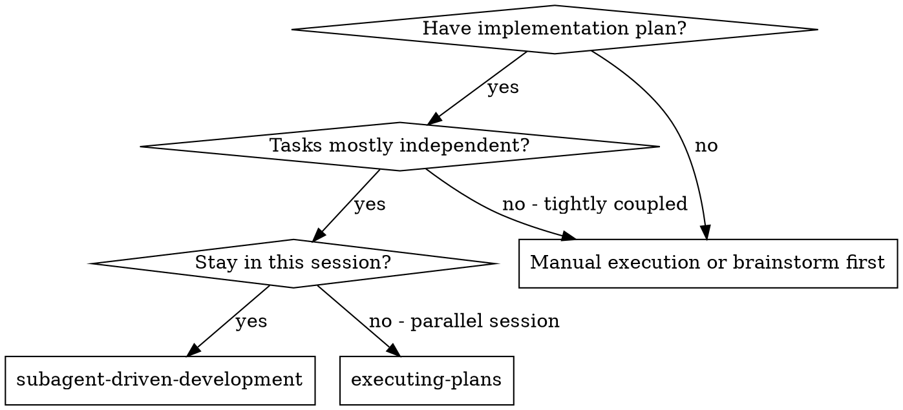
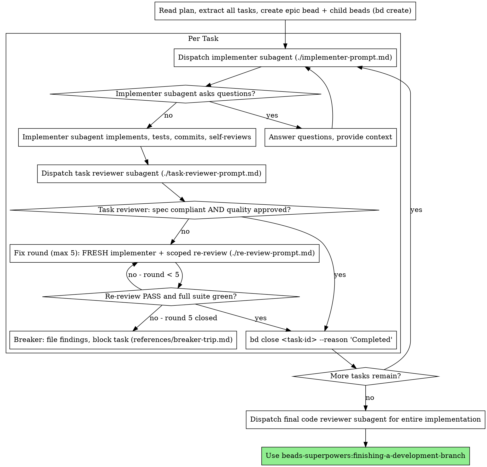
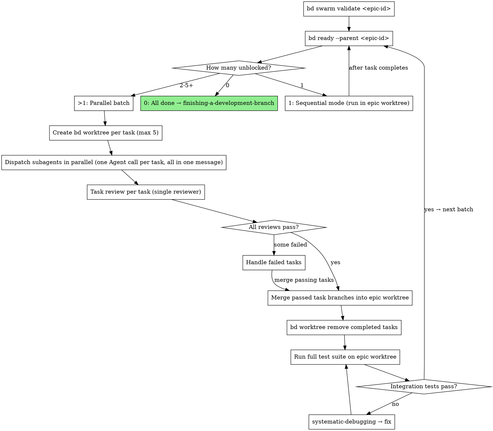

# Subagent-Driven Development

Execute plan by dispatching fresh subagent per task, with a single read-only task review after each — one reviewer returns a spec-compliance verdict and a code-quality verdict in one pass.

**Why subagents:** You delegate tasks to specialized agents with isolated context. By precisely crafting their instructions and context, you ensure they stay focused and succeed at their task. They should never inherit your session's context or history — you construct exactly what they need. This also preserves your own context for coordination work.

**Core principle:** Fresh subagent per task + a single read-only task review (spec + quality verdicts in one pass) = high quality, fast iteration

**Continuous execution:** Do not pause to check in with your human partner between tasks. Execute all tasks from the plan without stopping. The only reasons to stop are: BLOCKED status you cannot resolve, ambiguity that genuinely prevents progress, or all tasks complete. "Should I continue?" prompts and progress summaries waste their time — they asked you to execute the plan, so execute it.

## When to Use



**vs. Executing Plans (parallel session):**
- Same session (no context switch)
- Fresh subagent per task (no context pollution)
- One task review after each task: spec-compliance and code-quality verdicts in a single read-only pass
- Faster iteration (no human-in-loop between tasks)

## Pre-Flight Plan Review

Before dispatching Task 1, scan the plan once for conflicts:

- tasks that contradict each other or the plan's Global Constraints
- anything the plan explicitly mandates that the review rubric treats as a defect (a test that asserts nothing, verbatim duplication of a logic block)

Present everything you find to your human partner as **one batched structured question** — each finding beside the plan text that mandates it, asking which governs — before execution begins, not one interrupt per discovery mid-plan. If the scan is clean, proceed without comment. The review loop remains the net for conflicts that only emerge from implementation.

## The Process (Sequential Mode)

> This section describes **sequential execution** — one task at a time in a shared epic worktree. This is the default when tasks have dependencies or only one task is unblocked. For parallel execution of independent tasks, see **Parallel Batch Mode** below.



**Checking for remaining tasks:** Use `bd ready --parent <epic-id>` to see remaining unblocked child tasks. Use `bd epic status <epic-id>` for a summary view of completion percentage. When `bd ready` returns no results for the epic, all tasks are complete.

> **`--claim` consent boundary.** This skill's autonomous take-next / batch-dispatch flow is the one place `bd ready --claim` is legitimate. That autonomous `--claim` is FORBIDDEN wherever the user picks the work (orientation, brainstorming, session close) — the consent gate binds even when this skill is not loaded.

## Parallel Batch Mode

When `bd ready --parent <epic-id>` returns multiple unblocked tasks, those tasks have no dependencies between them and can execute in parallel — each in its own isolated `bd worktree`.

**Core principle:** One `bd worktree` per task + parallel dispatch = safe concurrency with per-task rollback.

**Parallel cap:** Maximum 5 subagents per batch. If more tasks are unblocked, split into batches of 5.

### Before you fan out (orchestrator-only)

Worktrees isolate *files*, not *assumptions* — parallel agents on different files can still diverge on an un-prescribed shared decision (MAST FC2). Before dispatching:

1. **Front-load shared decisions** — list every decision ≥2 agents depend on (schemas, naming, interfaces, conventions); decide each once and write it verbatim into *every* agent prompt.
2. **Share full context, not summaries** — give each agent the relevant traces/facts, not a lossy digest.

This is orchestrator discipline applied before dispatch; do not ask subagents to coordinate with each other.

### Batch Execution Flow



### Parallel Batch Walkthrough

```
1. Orchestrator creates epic worktree (once, at the start):
     bd worktree create .worktrees/<epic-name>

2. Analyze the work graph before dispatching:
     bd swarm validate <epic-id>
     → Shows wave structure (which tasks can run concurrently vs sequentially),
       max parallelism, estimated worker-sessions, and dependency warnings.
     Use this to plan batch sizes and catch missing dependencies before
     wasting subagent runs on tasks that will block.

3. Get unblocked tasks:
     bd ready --parent <epic-id>
     → Returns N tasks with no unresolved dependencies

4. If N > 1 (parallel batch, cap at 5 per batch):
   For each task in the batch:
     bd worktree create .worktrees/<task-name> --branch feature/<epic>/<task>

5. Dispatch all subagents in parallel:
   Read ./implementer-prompt.md, then one Agent tool call per task, ALL in the same message:
     Agent({
       description: "Implement Task N: <name>",
       prompt: "<implementer-prompt content with 'Work from: <task-worktree-path>'>",
       subagent_type: "general-purpose"
     })

6. Task review per task (can also run in parallel):
   Dispatch the single task reviewer (./task-reviewer-prompt.md) with the task
   brief, the implementer's report file, and the review-package diff. It returns
   a spec-compliance verdict (✅/❌/⚠️) and a code-quality verdict in one pass.

7. For each task that passes review:
     cd .worktrees/<epic-name>
     git merge feature/<epic>/<task>
     bd worktree remove .worktrees/<task-name>
     bd close <task-id> --reason "Completed: reviews passed"

8. Run full test suite on epic worktree (integration check):
   If fail → invoke systematic-debugging → fix before next batch

9. Re-run bd ready --parent <epic-id>
   Repeat from step 3 until no tasks remain

9. If N == 1 at any point:
   Sequential mode — run in epic worktree directly, no per-task worktree needed
```

> **Tip:** Use `bd -C .worktrees/<task> ready` to check task status across worktrees without changing directory.

> **Concurrent orchestrators (optional — `bd merge-slot`):** Step 7's merges run through a single orchestrator, one at a time, so the normal flow has no merge race and needs no coordination. The exception is when **two or more orchestrators or sessions** run SDD concurrently against the same repo (overlapping epics) — their merges into the shared base could collide. For that case only, serialize merges with the beads v1.0.5 merge slot: `bd merge-slot create` once for the repo, then wrap each task merge as `bd merge-slot acquire` → `git merge feature/<epic>/<task>` → `bd merge-slot release`, so only one orchestrator resolves conflicts at a time. Pairs with the `bd swarm validate` pre-step above.

### Failed Task Handling

When a parallel task fails review:

1. **Do not merge** its task branch into the epic branch.
2. **Option A — Fix rounds:** Keep the task worktree and run **`## Fix Rounds` / `## The Breaker`** below, unchanged: five-round cap, a FRESH implementer every round, scoped re-review via `./re-review-prompt.md`, PASS gated on a green full suite. Parallel mode gets no unbounded loop.
3. **Option B — Discard:** not a controller call. Discarding a failed task's branch (`bd worktree remove .worktrees/<task-name>`) is a disposition **the user** decides — surface it per `references/breaker-trip.md`; never adjudicate it yourself.
4. Other parallel tasks that passed review are still merged independently — one failure does not block the batch.

### Mode Selection

```
tasks = bd ready --parent <epic-id>

if len(tasks) == 0:
    All done → invoke finishing-a-development-branch
elif len(tasks) == 1:
    Sequential mode (run in epic worktree, existing behavior)
elif len(tasks) <= 5:
    Parallel batch (one bd worktree per task)
else:
    Take first 5 → parallel batch, remaining wait for next iteration
```

Mode selection is automatic. The orchestrator checks after every batch or sequential task completes.

## Model Selection

Use the least powerful model that can handle each role to conserve cost and increase speed.

**Always specify the model explicitly when dispatching a subagent.** An omitted model inherits your session's model — often the most expensive — which silently defeats this section.

**Mechanical implementation tasks** (isolated functions, clear specs, 1-2 files): use a fast, cheap model. Most implementation tasks are mechanical when the plan is well-specified.

**Integration and judgment tasks** (multi-file coordination, pattern matching, debugging): use a standard model.

**Architecture and design tasks**: use the most capable available model.

**Review tasks (task review, re-review, final review) default to the most capable tier** — that default is not a cost target to negotiate down. The one narrow exception: reviewing a genuinely small, mechanical diff (1-2 files, low complexity and risk, no design judgment) may use the standard tier — the scaling is by diff size, never by convenience or to cut cost (Production-Grade Doctrine).

**Fix-loop escalation:** when a fix round's re-review still leaves findings open, escalate the next round's implementer to a more capable tier before you simply run another round at the same tier — an extra round costs more turns than a tier bump costs tokens.

**Task complexity signals:**
- Touches 1-2 files with a complete spec → cheap model
- Touches multiple files with integration concerns → standard model
- Requires design judgment or broad codebase understanding → most capable model

## Handling Reviewer ⚠️ Items

The task reviewer returns a Spec Compliance verdict of ✅, ❌, or ⚠️. A ⚠️ "cannot verify from diff" item does **not** block the task on its own — but you (the controller) must resolve it, because it usually needs cross-task context the reviewer lacks. Check the named requirement against the broader implementation. If the ⚠️ turns out to be a real gap, treat it as a failed spec review and re-dispatch the implementer to close it; if it's actually satisfied elsewhere, record that and proceed.

## Fix Rounds

A review returning findings starts a fix round: dispatch a **fresh implementer**
(never resume) with the task brief, the current findings, and only the **most
recent** section of the report file. **Record `ROUND0_HEAD` (round 0's final
commit, not `BASE`) before dispatching fix round 1** — it is round 1's `<fix-base>`.
Then dispatch a scoped re-review filling `re-review-prompt.md` against
`scripts/review-package <plan-file> <fix-base> HEAD`.

**A re-review PASS requires the reviewer's verdict AND a green full test suite** —
**you (the controller) run the suite** and report it in `[SUITE_STATUS]`. What the
scoped reviewer cannot see, and why, is in `references/breaker-trip.md`.

**Completion criterion:** re-review returns PASS with a green suite, or the round
counter increments.

## The Breaker

The fix loop runs at most **five rounds**. If round five closes with findings still
open, the breaker trips — follow `references/breaker-trip.md`.

**Completion criterion:** every open finding has a bead ID, the task bead is
`blocked`, and the round history is surfaced to the user.

Implementer status handling (BLOCKED / NEEDS_CONTEXT and friends): see `references/breaker-trip.md`.

> **Blocker-bead stamp:** `bd create "[spec] <title>" -t task --parent <epic-id> --notes "Severity:/Confidence:/Evidence:"` — see `verification-before-completion` → Agent-Filed Bead Discipline.

## Final Review

Run `scripts/review-package <plan-file> <MERGE_BASE> HEAD` and dispatch a
most-capable-tier reviewer over the whole branch — the only place the composite of
all fix rounds is examined. Findings go to one fix subagent, then one scoped
re-review; residuals follow the breaker rules.

**Teardown:** remove the plan's workspace once the final review is clean **and**
each task's outcome and any implementer-raised concerns are recorded in beads.
Reports are the only non-regenerable artifact — delete once the record is durable.

## File Handoffs

Hand task text and review diffs to subagents as **files**, not pasted context — this keeps large text out of your own context and gives subagents a single thing to read.

- Before dispatching an implementer, run `scripts/task-brief <plan-file> <N>` → writes `.internal/sdd/<plan-basename>/task-<N>-brief.md`. Pass that path to the implementer as "read this first — it is your requirements."
- The implementer writes its full report to `.internal/sdd/<plan-basename>/task-<N>-report.md` (you name the path via `[REPORT_FILE]`); the reviewer reads it as a file. Fix rounds **append** to it.
- Before dispatching the reviewer, run `scripts/review-package <plan-file> <BASE> <HEAD>` → writes `.internal/sdd/<plan-basename>/review-<base7>..<head7>.diff`. `BASE` is the commit recorded before the implementer ran — never `HEAD~1`.
- The reviewer is **read-only**: it must not mutate the working tree, the index, HEAD, or branch state.
- The workspace is resolved **per plan, per working tree** (`scripts/sdd-workspace <plan-file>`). Two plans in one tree never share brief filenames, and in Parallel Batch Mode each `bd worktree` gets its own tree.

## Authoring Text for Machine Readers (STE)

Every string you author in this workflow is parsed by an agent that cannot ask what
you meant: bead descriptions (`bd create`), scene-setting context in implementer
prompts, answers to subagent questions, review-finding relays, close reasons, and
`bd remember` insights. Write them under the Simplified Technical English rules in
`references/ste-authoring.md` — short active sentences, one instruction per sentence,
one name per concept, hedges preserved.

The two failure modes this prevents are expensive here: a misread task brief costs a
full fix round, and synonym rotation across parallel task briefs makes independent
implementers diverge on shared names (a divergence no worktree isolates). Run the
reference's six-item scan checklist before `bd create` and before every dispatch.
Close reasons and memories get the same treatment — they are re-parsed after
compaction by an agent with no other context.

## Prompt Templates

Dispatch via the `Agent` tool:

1. `Read` the prompt template file
2. Use its content as the `prompt` parameter
3. Use `subagent_type: "general-purpose"` (do NOT use `"implementer"` — that is Claude Code's built-in implementer agent with its own system prompt, which overrides the prompt template)

- `./implementer-prompt.md` - Dispatch implementer subagent
- `./task-reviewer-prompt.md` - Dispatch the single task reviewer subagent (returns spec-compliance + code-quality verdicts in one read-only pass)
- `./re-review-prompt.md` - Scoped re-reviewer for fix rounds (checks the named findings only; PASS also requires a green suite)

## Example Workflow

```
You: I'm using Subagent-Driven Development to execute this plan.

[Read plan file once: .internal/plans/feature-plan.md]
[Extract all 5 tasks with full text and context]
[Create epic + tasks via bd import (parent-child rides the import; blocks wired after):]
[  bd create "Epic: <name>" -t epic -p 2 -d "<goal + '## Success Criteria' heading on its own line>"  -> note epic id]
[  Author tasks as JSONL, one per line, id OMITTED, each with a parent-child dep to the epic]
[    and "## Acceptance Criteria" in description; pipe to: bd import -]
[    (schema: bd import --help / bd export <id>; confirm output has no "Skipped dependency")]
[  Wire task ordering (blocks): bd ready --parent <epic-id> --json -> child ids, then]
[  printf 'dep add <t3> <t1> blocks\ndep add <t3> <t2> blocks\n' | bd batch]

Task 1: Hook installation script

[Get Task 1 text and context (already extracted)]
[Dispatch implementation subagent with full task text + context]

Implementer: "Before I begin - should the hook be installed at user or system level?"

You: "User level (~/.config/superpowers/hooks/)"

Implementer: "Got it. Implementing now..."
[Later] Implementer:
  - Implemented install-hook command
  - Added tests, 5/5 passing
  - Self-review: Found I missed --force flag, added it
  - Committed

[Generate review package: scripts/review-package PLAN_FILE BASE HEAD]
[Dispatch single task reviewer with the brief, report file, and diff]
Task reviewer:
  Spec Compliance: ✅ Spec compliant - all requirements met, nothing extra
  Strengths: Good test coverage, clean
  Issues: None
  Task quality: Approved

[bd close <task-1-id> --reason "Completed: review clean, commits a1b2c3d..e4f5a6b"]

Task 2: Recovery modes

[Get Task 2 text and context (already extracted)]
[Dispatch implementation subagent with full task text + context]

Implementer: [No questions, proceeds]
Implementer:
  - Added verify/repair modes
  - 8/8 tests passing
  - Self-review: All good
  - Committed

[Generate review package + dispatch single task reviewer]
Task reviewer:
  Spec Compliance: ❌ Issues:
    - Missing: Progress reporting (spec says "report every 100 items")
    - Extra: Added --json flag (not requested)
  Issues (Important): Magic number (100)
  Task quality: Needs fixes

[Fix round 1 of max 5: dispatch a FRESH implementer with the findings — never resume]
Implementer: Removed --json flag, added progress reporting, extracted PROGRESS_INTERVAL constant

[Re-generate review package + dispatch scoped re-reviewer (./re-review-prompt.md)]
Re-reviewer:
  Named findings: all resolved
  Full test suite: green → PASS

[bd close <task-2-id> --reason "Completed: review clean, commits e4f5a6b..c7d8e9f"]

...

[After all tasks]
[Dispatch final code-reviewer]
Final reviewer: All requirements met, ready to merge

Done!
```

## Durable Progress

Conversation memory does not survive compaction, and a controller that loses its place can re-dispatch completed tasks. **Beads is your durable ledger** — it survives compaction and is reloaded by the session hook's composed beads context (or `bd prime` if that context is missing). After any interruption, run `bd ready --parent <epic-id>`: tasks still open are the remaining work; closed task beads are done — do not re-dispatch them. Record each task's commit range in its close reason so `git log` recovery works without a separate file, e.g. `bd close <task-id> --reason "Completed: commits <base7>..<head7>, review clean"`. Do **not** keep a separate markdown progress ledger — the beads DB is the single source of truth.

**Capture what you learned.** At close, record durable, evidence-backed insights (still true next month, tied to a file, test, or command). Never record guesses, one-offs, or secrets (tokens, keys, PII — every memory is injected into all future sessions). Update in place (`bd remember --key <key>`) rather than adding a near-duplicate.

```bash
bd remember "<kind>: <durable, evidence-backed insight>"   # kind: lesson / pattern / design / root-cause / research
```

## Red Flags

| Rationalization | Reality |
|---|---|
| "It's a small change, I'll just start on main" | Never start implementation on main/master branch without your human partner's explicit consent — no exception for size. |
| "The task review is basically a formality here" | Never skip the task review, and never accept a report missing either verdict — spec-compliance AND code-quality are both required. |
| "Good enough, I'll move on" | Never proceed with unfixed issues. |
| "Parallel subagents on different files won't collide" | Every parallel subagent MUST have its own `bd worktree` — never dispatch parallel subagents without per-task worktree isolation. |
| "A few extra subagents this batch won't hurt" | Never dispatch more than 5 parallel subagents in a single batch (resource exhaustion). |
| "Claude's built-in `isolation: \"worktree\"` is the same thing" | It bypasses beads DB sharing — `bd worktree` is not optional isolation, it's the only isolation this skill recognizes. **Never** substitute Claude's `isolation: "worktree"` parameter for it. |
| "The subagent can just read the plan file itself" | Never make a subagent navigate the raw multi-task plan file — give it a focused, self-contained task brief instead (`scripts/task-brief` writes one, see File Handoffs). |
| "It'll figure out where the task fits" | Never skip scene-setting context — the subagent needs to understand where its task fits. |
| "It's prose for an LLM, it'll figure out what I meant" | A subagent parses your text with no follow-up round. Ambiguous bead text costs fix rounds — author it under `references/ste-authoring.md` (STE rules: one instruction per sentence, one name per concept). |
| "Ignore subagent questions, keep it moving" | Answer clearly and completely, provide additional context if needed, and don't rush the subagent into implementation. |
| "Close enough on spec compliance" / "Accept 'close enough' on spec compliance" | Reviewer found spec issues = not done. Fix it, or run out the five-round cap and let the breaker take over (`references/breaker-trip.md`) — those are the only exits. |
| "Skip review loops (reviewer found issues = implementer fixes = review again)" / "The fix was small, skip the re-review" / "Don't skip the re-review" | Unreviewed fixes are how regressions land. Every fix round ends with a scoped re-review — no exception for a small diff. |
| "Let implementer self-review replace the task review" | Both are needed — self-review never substitutes for the task review. |
| "One more task while this review sits open won't hurt" | Never move to the next task while the review has open issues. |
| "Coach a reviewer to suppress findings" | Never instruct a reviewer to ignore or not flag an issue, or pre-rate a finding's severity. If your reviewer prompt contains "do not flag", "don't treat X as a defect", "at most Minor", or "the plan chose", stop: you are pre-judging. Let the reviewer raise it and adjudicate in the review loop. |
| "I'll fix it myself, dispatching is overhead" / "Don't try to fix manually (context pollution)" | Controller fixes pollute your context and skip review. Dispatch a fresh implementer through the fix loop with the specific findings instead — never resume, never fix it yourself. |
| "One more round will converge" / "Just one more fix round, it's nearly there" | Past the cap, rounds don't converge — the loop is capped at five rounds. At the cap, file the findings and surface them to the user (`references/breaker-trip.md`). |
| "The reviewer will just find something new anyway" | A scoped re-review verifies only the named findings in the fix diff; it cannot wander. New findings on code the fix diff didn't touch aren't this round's job — track them separately, they don't extend the loop. |
| "This finding is obviously wrong, I'll drop it" | Never self-adjudicate a finding. At the round cap, file every open finding as a bead and surface both dispositions to the user — silent discards are forbidden. |
| "Reviews slow the loop down" | The loop without reviews is just unverified churn — reviews are the loop's brakes and steering. |
| "Recording progress in beads is overhead" | Beads is what survives compaction. Controllers that lose their place have re-dispatched entire completed task sequences — record each task's commit range in `bd close --reason` as you go. |
| "Discard or defer a failed task to quietly descope a required deliverable" / "let Model-Selection cost-minimization accept weaker correctness/security review" | Surface the trade-off, never take it silently (Production-Grade Doctrine). |

## Integration

**Required workflow skills:**
- **beads-superpowers:using-git-worktrees** - REQUIRED: Set up isolated workspace before starting
- **beads-superpowers:writing-plans** - Creates the plan this skill executes
- **beads-superpowers:requesting-code-review** - Code review template for reviewer subagents
- **beads-superpowers:finishing-a-development-branch** - Complete development after all tasks
- **beads-superpowers:dispatching-parallel-agents** - SDD's parallel batch mode uses this skill's dispatch pattern: when `bd ready --parent` returns multiple unblocked tasks, up to 5 are dispatched concurrently, each in its own worktree
- **beads-superpowers:receiving-code-review** - When the task review produces feedback, this skill's anti-sycophancy protocol ensures technical evaluation rather than blind acceptance

**Subagents should use:**
- **beads-superpowers:test-driven-development** - Subagents follow TDD for each task

**Parallel mode uses:**
- **beads-superpowers:using-git-worktrees** - Multiple worktrees for parallel task isolation
- **beads-superpowers:systematic-debugging** - Integration test failures after batch merge

**Alternative workflow:**
- **beads-superpowers:executing-plans** - Use for parallel session instead of same-session execution
